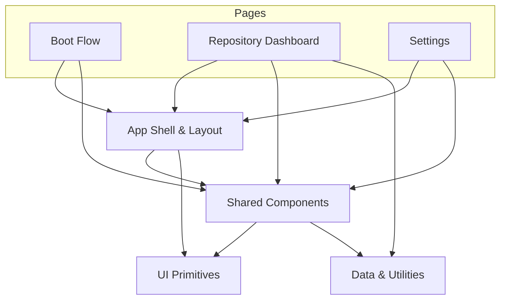

# Code Steward — Repository Overview

Code Steward is a Next.js demo application that provides an intelligent dashboard for managing and reviewing code repositories. The UI is built on a layered component architecture: generic design-system primitives at the bottom, shared application-level components in the middle, and feature pages on top.

## High-Level Structure

| Module | Responsibility |
|---|---|
| **[UI Primitives](ui-primitives.md)** | Low-level design-system components (buttons, cards, dialogs, inputs, etc.) consumed everywhere. |
| **[Shared Components](shared-components.md)** | Reusable app-level chrome — header, theme switcher, repo cards, and dialogs. |
| **[App Shell & Layout](app-shell--layout.md)** | Root layout, global providers, and theming infrastructure that wrap every route. |
| **[Boot Flow](boot-flow.md)** | Initial onboarding / boot page shown on first launch. |
| **[Repository Dashboard](repository-dashboard.md)** | Dynamic `[id]` routes for a single repo: overview, docs, insights, issues, pulls, and review. |
| **[Settings](settings.md)** | Application-wide settings page. |
| **[Data & Utilities](data--utilities.md)** | Mock data layer with TypeScript types, sample fixtures, and general-purpose helpers. |

## Module Dependency Diagram

## Where to Go Next

Start with the foundational layers and work your way up:

1. **[UI Primitives](ui-primitives.md)** — understand the design-system building blocks.
2. **[Data & Utilities](data--utilities.md)** — see the types and mock data that drive the UI.
3. **[Shared Components](shared-components.md)** — learn how app-level components compose primitives.
4. **[App Shell & Layout](app-shell--layout.md)** — see how the root layout ties everything together.
5. **[Boot Flow](boot-flow.md)**, **[Repository Dashboard](repository-dashboard.md)**, and **[Settings](settings.md)** — explore each feature page.
