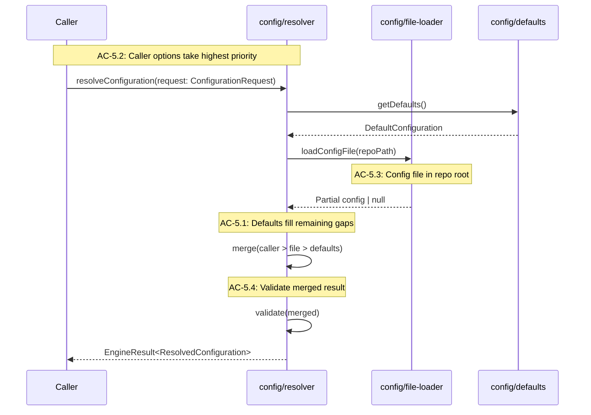
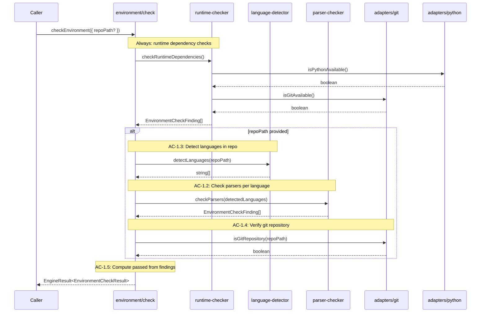
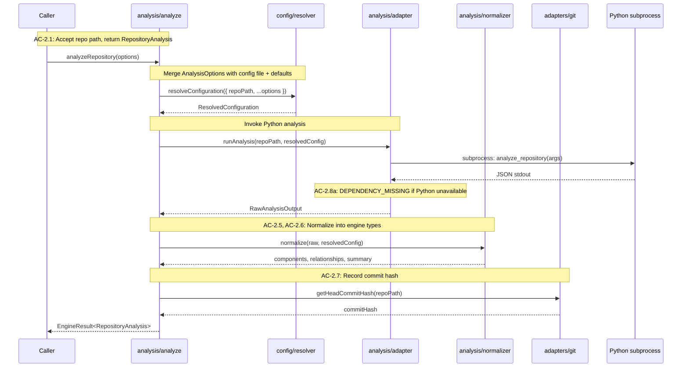
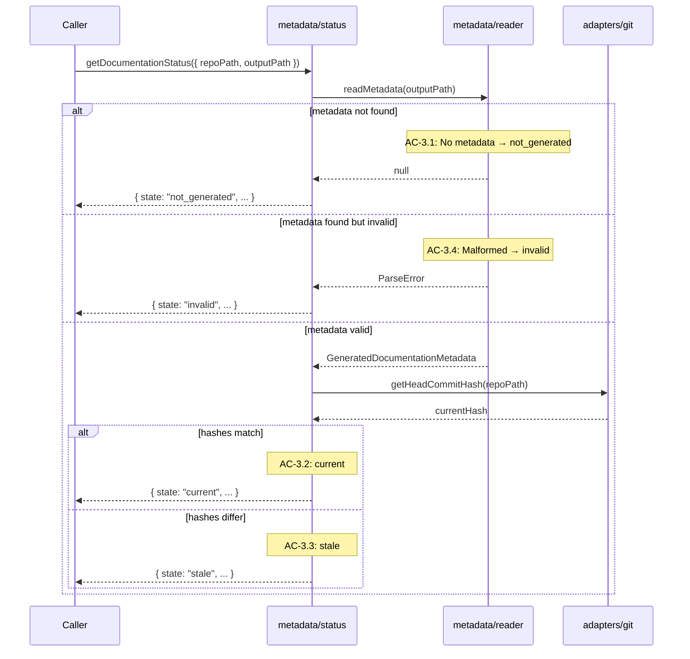
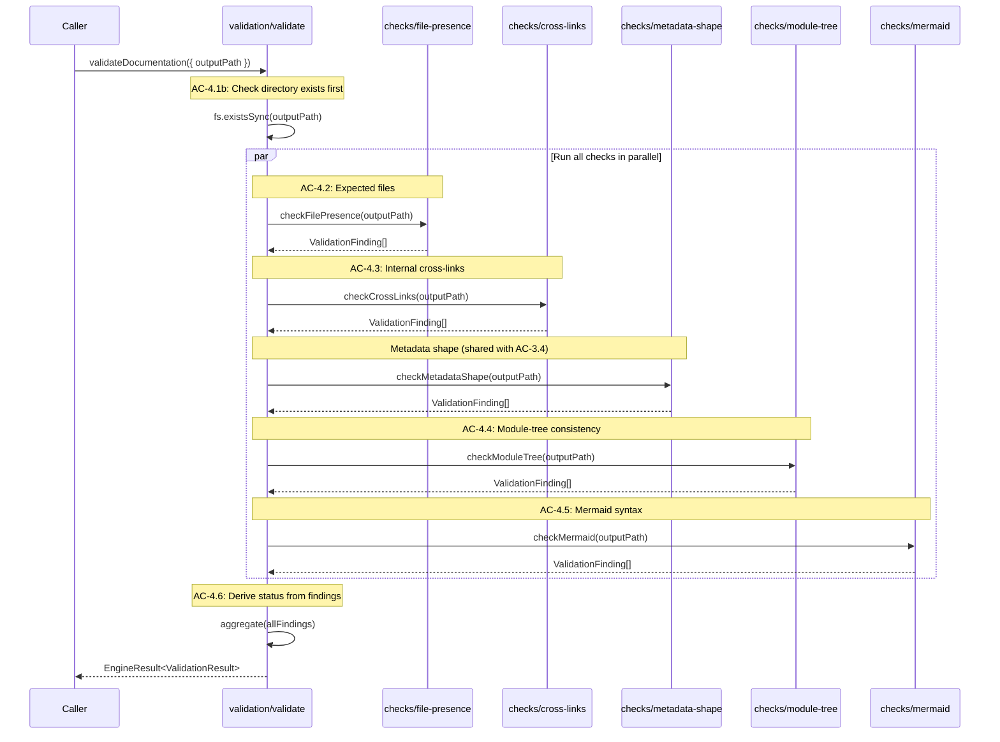

# Technical Design: Foundation & Analysis Runtime

## Purpose

This document translates the Epic 1 requirements into implementable architecture
for the Documentation Engine's foundational runtime layer. It serves three
audiences:

| Audience | Value |
|----------|-------|
| Reviewers | Validate design before code is written |
| Developers | Clear blueprint for implementation |
| Story Tech Sections | Source of implementation targets, interfaces, and test mappings |

**Prerequisite:** Epic 1 (Foundation & Analysis Runtime) — all ACs have TCs.

**Companion Document:** [test-plan.md](test-plan.md) — TC-to-test mapping, fixture
architecture, mock strategy. This design references the test plan rather than
carrying every mapping inline.

---

## Spec Validation

Before designing, validate the epic is implementation-ready.

**Validation Checklist:**

- [x] Every AC maps to clear implementation work
- [x] Data contracts are complete and realistic
- [x] Edge cases have TCs, not just happy path
- [x] No technical constraints the BA missed
- [x] Flows make sense from implementation perspective

**Issues Found:** None blocking. The epic's contract refinements
(`EnvironmentCheckFinding`, operation request types, `AnalysisOptions` →
`ResolvedConfiguration` merge model) resolved all ambiguity from the initial
review.

### Tech Design Questions — Answers

The epic raised six questions. Here are the design decisions:

| # | Question | Decision | Rationale |
|---|----------|----------|-----------|
| 1 | Raw vs normalized analysis output | Normalize immediately. Log raw output at debug level. Do not expose raw output in the v1 SDK surface. | Callers should never depend on adapter internals. Debug logging covers troubleshooting. If raw access is needed later, add an opt-in `debug` field to `RepositoryAnalysis`. |
| 2 | Metadata file naming | Keep `.doc-meta.json` and `module-tree.json`. | These names are explicit about purpose and don't collide with common project files. No reason to change for v1. |
| 3 | Mermaid validation depth | Regex-based: verify diagram type declaration line (`graph`, `flowchart`, `sequenceDiagram`, etc.) and basic bracket/quote balance within the block. No parsing library. | A full Mermaid parser is heavy and fragile. Regex catches the common failures (typo in diagram type, unclosed brackets) that break rendering. Severity is warning, not error — if the regex is wrong, the worst case is a missed warning. |
| 4 | Config file location | `.docengine.json` in repo root. Single search location in v1. | Repo root is discoverable and conventional alongside files like `package.json`, `tsconfig.json`, and `biome.json`. XDG adds complexity without clear v1 benefit. |
| 5 | Internal symbols | Exports only in v1. | Internal symbols add noise to the component model. Epic 2's clustering may benefit from them, but that's a decision for Epic 2's tech design. Keep the contract narrow now. |
| 6 | Monorepo handling | Single-unit analysis in v1. Workspace boundaries are noted in the summary but do not split the analysis. | Monorepo-aware splitting is complex and requires understanding package.json workspaces, tsconfig references, and build tool conventions. Single-unit is correct enough for v1. |

---

## Context

The Documentation Engine is a bounded local runtime inside Code Steward. It
generates, updates, validates, and tracks wiki documentation for repositories.
Epic 1 delivers the deterministic foundation: everything that can run without
Claude Agent SDK involvement. Epic 2 adds inference-driven generation and
updates. Epic 3 adds the CLI surface and Code Steward app integration.

The primary constraint shaping this design is the adapter boundary. V1 wraps
CodeWiki's proven Python analysis scripts rather than rebuilding structural
analysis in TypeScript. This means the engine has a subprocess dependency on
Python 3.11+ and tree-sitter grammars, which creates a runtime prerequisite
that the environment check flow must validate. The adapter pattern isolates
this dependency so it can be replaced with a native TypeScript implementation
later without changing the rest of the system.

The second constraint is the SDK-first architecture. The engine is a library
consumed by Code Steward server code, tests, the CLI, and future automation.
Every operation is a function call that accepts typed input and returns a typed
result. No operation requires network access, API keys, or agent availability.
This makes the entire Epic 1 surface testable with fixture repos and mocked
subprocesses — no integration environment required.

The third constraint is the error model. The epic defines two layers of
feedback: operational errors (the SDK function itself failed to execute) and
domain results (the function succeeded but found issues). Environment check
returns findings. Validation returns findings. Analysis returns a result or an
error. The SDK surface must make both layers explicit in the type system so
callers never have to guess which kind of failure occurred.

---

## High Altitude: System View

### System Context

Epic 1 operates entirely within the Documentation Engine SDK boundary. No
external systems are involved — no Claude API, no network, no database. The
engine reads from the local filesystem and git, and writes documentation
metadata to the filesystem.

```text
┌─────────────────────────────────────────────────────────┐
│  Callers                                                │
│  (Code Steward server, CLI, tests, automation)          │
└──────────────────────┬──────────────────────────────────┘
                       │ SDK function calls
                       ▼
┌─────────────────────────────────────────────────────────┐
│  Documentation Engine SDK (Epic 1 scope)                │
│                                                         │
│  ┌──────────┐  ┌──────────┐  ┌──────────┐  ┌────────┐ │
│  │  Config   │  │  Env     │  │ Analysis │  │Metadata│ │
│  │  Resolver │  │  Check   │  │ Runtime  │  │ & Stat │ │
│  └──────────┘  └──────────┘  └──────────┘  └────────┘ │
│  ┌──────────────────────────────────────────┐          │
│  │          Validation Pipeline             │          │
│  └──────────────────────────────────────────┘          │
│                                                         │
│  ┌─────────────── Adapters ─────────────────┐          │
│  │  Git  │  Python  │  Filesystem           │          │
│  └───────┴──────────┴───────────────────────┘          │
└─────────────────────────────────────────────────────────┘
                       │
            subprocess calls, fs read/write
                       ▼
┌─────────────────────────────────────────────────────────┐
│  Local Environment                                      │
│  Git repo  │  Python 3.11+  │  Tree-sitter  │  docs/   │
└─────────────────────────────────────────────────────────┘
```

The SDK exposes seven operations in Epic 1, mapped to the five design flows in
this document:

| Operation | Input | Output | Design Flow |
|-----------|-------|--------|-------------|
| `resolveConfiguration()` | `ConfigurationRequest` | `ResolvedConfiguration` | Flow 1 |
| `checkEnvironment()` | `EnvironmentCheckRequest` | `EnvironmentCheckResult` | Flow 2 |
| `analyzeRepository()` | `AnalysisOptions` | `RepositoryAnalysis` | Flow 3 |
| `getDocumentationStatus()` | `DocumentationStatusRequest` | `DocumentationStatus` | Flow 4 |
| `readMetadata()` | output path | `GeneratedDocumentationMetadata` | Flow 4 |
| `writeMetadata()` | `MetadataWriteRequest` | `void` | Flow 4 |
| `validateDocumentation()` | `ValidationRequest` | `ValidationResult` | Flow 5 |

### External Contracts

No external system contracts exist in Epic 1. All boundaries are local:

| Boundary | Type | Direction |
|----------|------|-----------|
| Python subprocess | Child process (stdin/stdout JSON) | Engine → Python |
| Git CLI | Child process (stdout text) | Engine → Git |
| Filesystem | Node.js `fs` | Engine ↔ Disk |

**Error Responses from Boundaries:**

| Boundary | Failure Mode | Engine Handling |
|----------|-------------|-----------------|
| Python subprocess | Process not found | `DEPENDENCY_MISSING` error |
| Python subprocess | Non-zero exit code | `ANALYSIS_ERROR` with stderr in details |
| Python subprocess | Invalid JSON output | `ANALYSIS_ERROR` with parse error |
| Git CLI | Process not found | `DEPENDENCY_MISSING` error |
| Git CLI | Not a git repo | `invalid-repo` finding in `EnvironmentCheckResult` |
| Filesystem | Path not found | `PATH_ERROR` error |
| Filesystem | Permission denied | `PATH_ERROR` error |

### Runtime Prerequisites

| Prerequisite | Where Needed | How to Verify |
|---|---|---|
| Node 24 LTS | All operations | `node --version` |
| Python 3.11+ | Analysis adapter | `python3 --version` — also verified by `checkEnvironment()` |
| Tree-sitter grammars (TS/JS min) | Analysis adapter | Parser availability check in `checkEnvironment()` |
| Git | Commit hash, repo validation | `git --version` — also verified by `checkEnvironment()` |
| CodeWiki analysis scripts (bundled) | Analysis adapter | Script path existence check |

### Toolchain Baseline

Epic 1 should assume the package/tooling baseline decided for
`packages/documentation-engine`:

| Area | Decision |
|------|----------|
| Runtime target | Node 24 LTS (`engines: >=24 <25`) |
| Language | TypeScript 5.9.x |
| Module format | ESM-only with `"type": "module"` and `NodeNext` |
| Build | `tsc` |
| Dev execution | `tsx` |
| Testing | Vitest |
| Lint + format | Biome |
| Contracts | `zod` schemas paired with exported TypeScript types |

Prefer Node built-ins for config loading, path handling, subprocess execution,
git integration, and globbing in v1. The Python-backed analyzer remains the
baseline here, but only as a deliberate mixed-runtime compromise around the
analysis adapter boundary.

---

## Medium Altitude: Module Architecture

### File Structure

```text
packages/documentation-engine/
  package.json
  tsconfig.json
  biome.json
  vitest.config.ts
  src/
    index.ts                          # SDK public API — re-exports all operations
    types/
      index.ts                        # Re-exports all type modules
      common.ts                       # EngineResult<T>, EngineError, EngineErrorCode
      environment.ts                  # EnvironmentCheckRequest, EnvironmentCheckResult, EnvironmentCheckFinding
      analysis.ts                     # AnalysisOptions, RepositoryAnalysis, AnalyzedComponent, ExportedSymbol, etc.
      metadata.ts                     # DocumentationStatusRequest, DocumentationStatus, MetadataWriteRequest, GeneratedDocumentationMetadata
      validation.ts                   # ValidationRequest, ValidationResult, ValidationFinding, ModuleTreeEntry
      configuration.ts                # ResolvedConfiguration
    contracts/
      configuration.ts                # zod schemas for config file and resolved configuration
      metadata.ts                     # zod schemas for .doc-meta.json
      validation.ts                   # zod-backed validation result/finding shapes when runtime parsing is needed
    config/
      defaults.ts                     # Built-in default values
      file-loader.ts                  # .docengine.json discovery and parsing
      resolver.ts                     # Three-level merge: caller > config file > defaults
    environment/
      check.ts                        # checkEnvironment() — orchestrates all checks
      runtime-checker.ts              # Python, Git, bundled scripts availability
      language-detector.ts            # Scan file extensions → language list
      parser-checker.ts               # Tree-sitter grammar availability per detected language
    analysis/
      analyze.ts                      # analyzeRepository() — orchestrates adapter + normalization
      adapter.ts                      # Python subprocess invocation, stdout JSON capture
      normalizer.ts                   # Raw CodeWiki output → RepositoryAnalysis
    metadata/
      status.ts                       # getDocumentationStatus() — read metadata, compare commits
      reader.ts                       # readMetadata() — parse .doc-meta.json, delegate to validate-shape
      writer.ts                       # writeMetadata() — serialize and persist .doc-meta.json
      validate-shape.ts               # Pure schema validation for .doc-meta.json — shared by reader and validation check
    validation/
      validate.ts                     # validateDocumentation() — run all checks, aggregate
      checks/
        file-presence.ts              # Expected files: overview.md, module-tree.json, .doc-meta.json, .module-plan.json
        cross-links.ts                # Internal relative markdown link resolution
        metadata-shape.ts             # .doc-meta.json schema validation
        module-tree.ts                # module-tree.json ↔ page file consistency
        mermaid.ts                    # Regex-based Mermaid block syntax checks
    adapters/
      git.ts                          # getHeadCommitHash(), isGitRepository()
      python.ts                       # isPythonAvailable(), getPythonVersion()
      subprocess.ts                   # Generic subprocess runner with timeout and error capture
  test/
    fixtures/                         # See Test Plan for fixture architecture
    helpers/
```

### Module Responsibility Matrix

Each row maps a module to its responsibility, dependencies, and the ACs it
serves. This is the rosetta stone connecting functional requirements to code
locations.

| Module | Responsibility | Dependencies | ACs Covered |
|--------|----------------|--------------|-------------|
| `config/resolver.ts` | Merge caller options + config file + defaults into `ResolvedConfiguration` | `config/defaults.ts`, `config/file-loader.ts` | AC-5.1 to AC-5.5 |
| `config/defaults.ts` | Provide built-in default values | None | AC-5.1 |
| `config/file-loader.ts` | Discover and parse `.docengine.json` | `node:fs`, `contracts/configuration.ts` | AC-5.3 |
| `environment/check.ts` | Orchestrate runtime checks + repo-aware language/parser checks | `runtime-checker`, `language-detector`, `parser-checker`, `adapters/git` | AC-1.1 to AC-1.5 |
| `environment/runtime-checker.ts` | Check Python, Git, bundled script availability | `adapters/python`, `adapters/git` | AC-1.2 |
| `environment/language-detector.ts` | Scan repo for file extensions, map to languages | Filesystem | AC-1.3 |
| `environment/parser-checker.ts` | Check tree-sitter grammar availability per language | `adapters/python` (grammar check via subprocess) | AC-1.2, AC-1.5 |
| `analysis/analyze.ts` | Orchestrate adapter invocation + normalization | `analysis/adapter`, `analysis/normalizer`, `config/resolver`, `adapters/git` | AC-2.1 to AC-2.8 |
| `analysis/adapter.ts` | Invoke Python analysis subprocess, capture JSON | `adapters/subprocess` | AC-2.1, AC-2.8 |
| `analysis/normalizer.ts` | Transform raw CodeWiki output → `RepositoryAnalysis` | Types only | AC-2.5, AC-2.6 |
| `metadata/status.ts` | Read metadata + compare commit hashes → `DocumentationStatus` | `metadata/reader`, `adapters/git` | AC-3.1 to AC-3.4 |
| `metadata/reader.ts` | Parse `.doc-meta.json`, delegate shape validation to `validate-shape.ts` | `metadata/validate-shape.ts`, Filesystem | AC-3.4, AC-3.6 |
| `metadata/writer.ts` | Serialize and persist `.doc-meta.json` | Filesystem | AC-3.5 |
| `metadata/validate-shape.ts` | Pure function: validate `.doc-meta.json` shape (required fields, types) via a shared `zod` contract. Single source of truth used by both `metadata/reader.ts` and `validation/checks/metadata-shape.ts`. | `contracts/metadata.ts` (no I/O) | AC-3.4 (shared) |
| `validation/validate.ts` | Run all validation checks, aggregate into `ValidationResult` | All `validation/checks/*` modules | AC-4.1, AC-4.6 |
| `validation/checks/file-presence.ts` | Check for expected files | Filesystem | AC-4.2 |
| `validation/checks/cross-links.ts` | Parse markdown links, verify targets exist | Filesystem | AC-4.3 |
| `validation/checks/metadata-shape.ts` | Read `.doc-meta.json`, delegate to `metadata/validate-shape.ts`. No-ops if file absent (gating rule). Emits `category: "metadata"` error findings when the file exists but is invalid. | `metadata/validate-shape.ts`, Filesystem | AC-3.4 (shared shape validation), AC-4.6 |
| `validation/checks/module-tree.ts` | Module-tree ↔ page file consistency | Filesystem | AC-4.4 |
| `validation/checks/mermaid.ts` | Regex-based Mermaid syntax checks | None (pure regex) | AC-4.5 |
| `adapters/git.ts` | Git operations: commit hash, repo validation | `adapters/subprocess` | Supports AC-1.4, AC-2.7, AC-3.2, AC-3.3 |
| `adapters/python.ts` | Python availability check | `adapters/subprocess` | Supports AC-1.2 |
| `adapters/subprocess.ts` | Generic subprocess runner with timeout | `node:child_process` | Foundation for all adapters |

### Module Interaction

Runtime communication flows through these paths. Each SDK function is an
entry point that orchestrates internal modules.

```text
resolveConfiguration()
    └── defaults.ts + file-loader.ts → resolver.ts → ResolvedConfiguration

checkEnvironment()
    ├── runtime-checker.ts → adapters/python.ts, adapters/git.ts
    ├── language-detector.ts → filesystem scan
    └── parser-checker.ts → adapters/python.ts (grammar check)

analyzeRepository()
    ├── resolver.ts → merge AnalysisOptions with config
    ├── adapter.ts → adapters/subprocess.ts → Python process
    ├── normalizer.ts → RepositoryAnalysis
    └── adapters/git.ts → commit hash

getDocumentationStatus()
    ├── metadata/reader.ts → .doc-meta.json
    └── adapters/git.ts → current HEAD

validateDocumentation()
    ├── checks/file-presence.ts
    ├── checks/cross-links.ts
    ├── checks/metadata-shape.ts
    ├── checks/module-tree.ts
    └── checks/mermaid.ts
```

---

## Medium Altitude: Flow-by-Flow Design

Each flow corresponds to an epic section. Sequence diagrams show module
interactions with AC annotations. TC-to-test mappings are in the companion
test plan.

### Flow 1: Configuration Resolution

**Covers:** AC-5.1 through AC-5.5

Configuration resolution is the foundation operation — every other flow depends
on it. The caller provides partial options (or nothing). The engine fills in
gaps from the config file and defaults, validates the result, and returns a
complete `ResolvedConfiguration`.

The three-level merge is field-by-field, not object-level. If the caller
provides `outputPath` but not `excludePatterns`, the engine uses the caller's
output path and the config file's exclude patterns (or defaults if no config
file). This partial override model (AC-5.2c) is the most common use case.



**Skeleton Requirements:**

| What | Path | Stub Signature |
|------|------|----------------|
| Resolver | `src/config/resolver.ts` | `export const resolveConfiguration = async (request?: ConfigurationRequest): Promise<EngineResult<ResolvedConfiguration>> => { throw new NotImplementedError('resolveConfiguration') }` |
| Defaults | `src/config/defaults.ts` | `export const getDefaults = (): DefaultConfiguration => { throw new NotImplementedError('getDefaults') }` |
| File loader | `src/config/file-loader.ts` | `export const loadConfigFile = async (...): Promise<Partial<ResolvedConfiguration> \| null> => { throw new NotImplementedError('loadConfigFile') }` |

---

### Flow 2: Environment & Dependency Check

**Covers:** AC-1.1 through AC-1.5

The environment check is the preflight gate. It verifies runtime dependencies
first (Python, Git, bundled analysis scripts), then optionally checks
repo-specific concerns (language detection, parser availability, git repository
validity). The two-tier dependency model from the epic maps directly to two
phases of execution.

The result uses `EnvironmentCheckFinding` objects — not overlapping string
arrays. Each finding has a severity, category, message, and optional
`dependencyName` or `path`. This makes programmatic handling straightforward:
callers filter by severity or category without parsing messages.



**Key implementation detail:** `passed` is derived, not set manually. After
collecting all findings, `passed = !findings.some(f => f.severity === "error")`.
This prevents inconsistency between the findings list and the boolean flag.

**Skeleton Requirements:**

| What | Path | Stub Signature |
|------|------|----------------|
| Check orchestrator | `src/environment/check.ts` | `export const checkEnvironment = async (...): Promise<EngineResult<EnvironmentCheckResult>>` |
| Runtime checker | `src/environment/runtime-checker.ts` | `export const checkRuntimeDependencies = async (): Promise<EnvironmentCheckFinding[]>` |
| Language detector | `src/environment/language-detector.ts` | `export const detectLanguages = async (repoPath: string): Promise<string[]>` |
| Parser checker | `src/environment/parser-checker.ts` | `export const checkParsers = async (languages: string[]): Promise<EnvironmentCheckFinding[]>` |

---

### Flow 3: Structural Analysis

**Covers:** AC-2.1 through AC-2.8

Analysis is the heaviest operation in Epic 1. It invokes the Python analysis
adapter as a subprocess, captures the raw JSON output, normalizes it into
engine-native types, and enriches it with the current git commit hash.

The adapter is isolated behind an interface so the Python subprocess can be
replaced later with native TypeScript analysis. The normalizer is a pure
function that transforms the raw output shape — no I/O, no side effects.



**Normalization Mapping — CodeWiki → Engine Types:**

The CodeWiki analysis produces `functions` (nodes), `relationships` (call
edges), `file_tree`, and `summary`. The normalizer transforms these into the
epic's contracts:

| CodeWiki Output | Engine Type | Transformation |
|-----------------|-------------|----------------|
| `Node[]` grouped by `file_path` | `Record<string, AnalyzedComponent>` | Group nodes by file. Each file becomes one component. Exported nodes become `ExportedSymbol` entries. |
| `Node.name` | `ExportedSymbol.name` | Direct mapping |
| `Node.component_type` | `ExportedSymbol.kind` | Map: "function"→"function", "class"→"class", "method"→"function". See mapping table below. |
| `Node.start_line` | `ExportedSymbol.lineNumber` | Direct mapping |
| `Node.depends_on` | `AnalyzedRelationship` with `type: "import"` | Group by source file path. Each dependency from file A on a symbol in file B creates one relationship. |
| `CallRelationship` | `AnalyzedRelationship` with `type: "usage"` | Map caller/callee to file paths. Deduplicate with import relationships. |
| `summary.total_files` | `AnalysisSummary.totalFilesAnalyzed` | Direct mapping |
| `summary.languages_found` | `AnalysisSummary.languagesFound` | Direct mapping |
| `summary.unsupported_files` | `AnalysisSummary.languagesSkipped` | Derive from unsupported file extensions |

**`ExportedSymbol.kind` Mapping:**

| CodeWiki `component_type` | Engine `kind` |
|---------------------------|---------------|
| `"function"` | `"function"` |
| `"class"` | `"class"` |
| `"method"` | `"function"` |
| `"interface"` (TS) | `"interface"` |
| `"type_alias"` (TS) | `"type"` |
| `"enum"` | `"enum"` |
| `"variable"` (mutable `let`/`var`) | `"variable"` |
| `"constant"` (immutable `const`, UPPER_CASE) | `"constant"` |
| anything else | `"other"` |

**Include/exclude/focus filtering (AC-2.2, AC-2.3, AC-2.4):** Patterns are
passed to the analysis adapter as arguments. The adapter applies them before
analysis (preferred) or the normalizer filters results post-analysis. Focus
directories are preserved in the output unchanged — they're metadata for
Epic 2's clustering, not a filter.

**Skeleton Requirements:**

| What | Path | Stub Signature |
|------|------|----------------|
| Analyze orchestrator | `src/analysis/analyze.ts` | `export const analyzeRepository = (...): Promise<EngineResult<RepositoryAnalysis>>` |
| Adapter | `src/analysis/adapter.ts` | `export const runAnalysis = (...): Promise<RawAnalysisOutput>` |
| Normalizer | `src/analysis/normalizer.ts` | `export const normalize = (raw: RawAnalysisOutput, config: ResolvedConfiguration): NormalizedAnalysis` |

---

### Flow 4: Metadata & Status

**Covers:** AC-3.1 through AC-3.6

Metadata operations are the simplest flow — pure filesystem reads and writes
with commit hash comparison. The status function reads `.doc-meta.json` from
the output directory, validates its shape, compares the stored commit hash to
the current HEAD, and returns a four-state status.

The four states form a decision tree:

```text
Does .doc-meta.json exist?
  ├── No → "not_generated"
  └── Yes → Is it valid JSON with required fields?
        ├── No → "invalid"
        └── Yes → Does commitHash match current HEAD?
              ├── Yes → "current"
              └── No → "stale"
```



When `DocumentationStatusRequest.outputPath` is not provided, the status
function resolves configuration to determine the output path. This means status
queries work with zero configuration — the engine finds docs in the default
location.

The metadata write operation (`writeMetadata`) is independent of status. The
caller provides a complete `MetadataWriteRequest` containing the output path
and the `GeneratedDocumentationMetadata` payload. The writer serializes to JSON
and persists. If a previous `.doc-meta.json` exists, it's replaced entirely.

**Skeleton Requirements:**

| What | Path | Stub Signature |
|------|------|----------------|
| Status | `src/metadata/status.ts` | `export const getDocumentationStatus = async (...): Promise<EngineResult<DocumentationStatus>>` |
| Reader | `src/metadata/reader.ts` | `export const readMetadata = async (outputPath: string): Promise<EngineResult<GeneratedDocumentationMetadata>>` |
| Writer | `src/metadata/writer.ts` | `export const writeMetadata = async (request: MetadataWriteRequest): Promise<EngineResult<void>>` |

---

### Flow 5: Validation

**Covers:** AC-4.1 through AC-4.6

Validation is a pure pipeline. Five independent checks run against an output
directory, each producing zero or more `ValidationFinding` objects. The
orchestrator aggregates all findings and derives the overall status.

Each check is an async function with the same signature:
`async (outputPath: string) => Promise<ValidationFinding[]>`. This makes the
pipeline trivially extensible — add a new check function, add it to the
orchestrator's list.

**Gating rule: checks that depend on a specific file must no-op (return empty
findings) when that file is absent.** File absence is already reported by
`file-presence.ts` — if `metadata-shape.ts` or `module-tree.ts` also report
on a missing file, findings duplicate and conflict. Concretely:

- `metadata-shape.ts`: if `.doc-meta.json` does not exist, return `[]`. File
  presence is `file-presence.ts`'s responsibility. If the file exists but is
  invalid JSON or missing required fields, return one or more
  `category: "metadata"` error findings.
- `module-tree.ts`: if `module-tree.json` does not exist, return `[]`. Same
  reason.
- `cross-links.ts`: if no `.md` files exist, return `[]`.
- `mermaid.ts`: if no `.md` files exist, return `[]`.

This means all five checks can safely run in parallel without coordination.
Each check is self-contained: it reads only what it needs and silently no-ops
when its target is absent.



**Cross-link check specifics (AC-4.3):** The checker parses markdown files for
internal relative links using a regex pattern that matches `[text](path.md)` and
`[text](./path.md)` forms. It ignores anchor-only links (`#heading`), external
URLs (`http://`, `https://`), and non-markdown targets (images, etc.). For each
internal link, it verifies the target file exists relative to the output
directory.

**Metadata-shape check specifics (AC-4.6):** The checker reads
`.doc-meta.json` only when the file exists. It delegates parsing and schema
validation to `metadata/validate-shape.ts`. Invalid JSON or missing required
fields produce `severity: "error"` findings with `category: "metadata"` and
`filePath` pointing to `.doc-meta.json`. Those findings participate in normal
status derivation, so malformed metadata makes validation return `status:
"fail"`.

**Module-tree check specifics (AC-4.4):** The checker loads `module-tree.json`,
collects all `page` values from the tree (recursively through `children`), then
compares against actual `.md` files in the output directory. Structural files
(`overview.md`) are excluded from the orphan check. The excluded set is defined
as a constant — easily extensible if new structural files are added.

**Mermaid check specifics (AC-4.5):** The checker scans markdown files for
fenced code blocks tagged with `` ```mermaid ``. For each block, it verifies:
(1) the first non-empty line is a recognized diagram type keyword (`graph`,
`flowchart`, `sequenceDiagram`, `classDiagram`, `stateDiagram`, `erDiagram`,
`gantt`, `pie`, `gitgraph`), and (2) brackets/braces/quotes are balanced within
the block. Failures are warnings, not errors.

**Skeleton Requirements:**

| What | Path | Stub Signature |
|------|------|----------------|
| Orchestrator | `src/validation/validate.ts` | `export const validateDocumentation = async (...): Promise<EngineResult<ValidationResult>>` |
| File presence | `src/validation/checks/file-presence.ts` | `export const checkFilePresence = async (outputPath: string): Promise<ValidationFinding[]>` |
| Cross-links | `src/validation/checks/cross-links.ts` | `export const checkCrossLinks = async (outputPath: string): Promise<ValidationFinding[]>` |
| Metadata shape | `src/validation/checks/metadata-shape.ts` | `export const checkMetadataShape = async (outputPath: string): Promise<ValidationFinding[]>` |
| Module tree | `src/validation/checks/module-tree.ts` | `export const checkModuleTree = async (outputPath: string): Promise<ValidationFinding[]>` |
| Mermaid | `src/validation/checks/mermaid.ts` | `export const checkMermaid = async (outputPath: string): Promise<ValidationFinding[]>` |

---

## Low Altitude: Interface Definitions

### Result Type

Every SDK operation returns an `EngineResult<T>`. This makes the error path
explicit in the type system — callers must check `ok` before accessing the
value. Operations that can produce domain-level findings (environment check,
validation) return the findings inside the success value, not as errors.

```typescript
// types/common.ts

/**
 * Discriminated union for SDK operation results.
 *
 * ok: true → operation completed, value contains the result
 * ok: false → operation failed to execute, error describes why
 *
 * Domain-level findings (e.g., missing dependency, broken link) appear
 * inside the success value, not as EngineError. EngineError is reserved
 * for operational failures (couldn't run the check at all).
 */
export type EngineResult<T> =
  | { ok: true; value: T }
  | { ok: false; error: EngineError };

export type EngineErrorCode =
  | "ENVIRONMENT_ERROR"
  | "DEPENDENCY_MISSING"
  | "ANALYSIS_ERROR"
  | "METADATA_ERROR"
  | "VALIDATION_ERROR"
  | "CONFIGURATION_ERROR"
  | "PATH_ERROR";

export interface EngineError {
  code: EngineErrorCode;
  message: string;
  details?: unknown;
}

/** Helper to construct success results */
export const ok = <T>(value: T): EngineResult<T> => ({ ok: true, value });

/** Helper to construct error results */
export const err = <T>(code: EngineErrorCode, message: string, details?: unknown): EngineResult<T> =>
  ({ ok: false, error: { code, message, details } });

/**
 * Thrown by skeleton stubs during TDD Red phase.
 * Green phase replaces throws with real implementation.
 */
export class NotImplementedError extends Error {
  constructor(name: string) {
    super(`${name} is not yet implemented`);
    this.name = "NotImplementedError";
  }
}
```

### Configuration Types

```typescript
// types/configuration.ts

/**
 * Input for resolveConfiguration(). All fields optional.
 * Merged with config file values and built-in defaults.
 * repoPath is used to locate the config file (.docengine.json in repo root).
 */
export interface ConfigurationRequest {
  repoPath?: string;
  outputPath?: string;
  includePatterns?: string[];
  excludePatterns?: string[];
  focusDirs?: string[];
}

/**
 * Fully resolved configuration with all fields populated.
 * Produced by resolveConfiguration(). Consumed by all operations.
 *
 * Supports: AC-5.1 (defaults), AC-5.2 (priority), AC-5.5 (typed access)
 */
export interface ResolvedConfiguration {
  outputPath: string;
  includePatterns: string[];
  excludePatterns: string[];
  focusDirs: string[];
}

/**
 * Built-in defaults. Every field has a value.
 * Lowest priority in the merge chain.
 */
export interface DefaultConfiguration extends ResolvedConfiguration {}
```

### Environment Types

```typescript
// types/environment.ts

/**
 * Input for checkEnvironment().
 * repoPath is optional — when absent, only runtime deps are checked.
 */
export interface EnvironmentCheckRequest {
  repoPath?: string;
}

/**
 * Result of environment check. passed is derived: true when no
 * error-severity findings exist.
 *
 * Supports: AC-1.1 (structured result), AC-1.3 (detected languages)
 */
export interface EnvironmentCheckResult {
  passed: boolean;
  findings: EnvironmentCheckFinding[];
  detectedLanguages: string[];
}

/**
 * Individual finding from environment check.
 * Callers filter by severity or category.
 *
 * Supports: AC-1.2 (named deps), AC-1.4 (git findings), AC-1.5 (severity)
 */
export interface EnvironmentCheckFinding {
  severity: "warning" | "error";
  category: "missing-dependency" | "invalid-repo" | "invalid-path" | "environment";
  message: string;
  dependencyName?: string;   // present when category is "missing-dependency"
  path?: string;             // present when category is "invalid-repo" or "invalid-path"
}
```

### Analysis Types

```typescript
// types/analysis.ts

/**
 * Caller-facing input for analyzeRepository().
 * Optional fields are merged with config file and defaults.
 */
export interface AnalysisOptions {
  repoPath: string;
  includePatterns?: string[];
  excludePatterns?: string[];
  focusDirs?: string[];
}

/**
 * Normalized analysis result. Components keyed by file path for O(1) lookup.
 * focusDirs preserved for Epic 2 clustering.
 *
 * Supports: AC-2.1 (normalized result), AC-2.7 (commit hash)
 */
export interface RepositoryAnalysis {
  repoPath: string;
  commitHash: string;
  summary: AnalysisSummary;
  components: Record<string, AnalyzedComponent>;  // keyed by file path
  relationships: AnalyzedRelationship[];
  focusDirs: string[];
}

export interface AnalysisSummary {
  totalFilesAnalyzed: number;
  totalComponents: number;
  totalRelationships: number;
  languagesFound: string[];
  languagesSkipped: string[];
}

/**
 * One analyzed source file.
 * filePath is both the Record key and a field for self-describing
 * components when passed individually.
 *
 * Supports: AC-2.5 (component structure)
 */
export interface AnalyzedComponent {
  filePath: string;
  language: string;
  exportedSymbols: ExportedSymbol[];
  linesOfCode: number;
}

export interface ExportedSymbol {
  name: string;
  kind: "function" | "class" | "interface" | "type" | "variable" | "enum" | "constant" | "other";
  lineNumber: number;
}

/**
 * Relationship between two source files.
 * source and target are file paths matching component Record keys.
 *
 * Supports: AC-2.6 (relationship structure)
 */
export interface AnalyzedRelationship {
  source: string;
  target: string;
  type: "import" | "inheritance" | "implementation" | "composition" | "usage";
}

/**
 * Intermediate type for raw CodeWiki output before normalization.
 * Internal to the analysis module — not part of the public SDK surface.
 */
export interface RawAnalysisOutput {
  functions: RawNode[];
  relationships: RawCallRelationship[];
  file_tree: Record<string, unknown>;
  summary: Record<string, unknown>;
}

export interface RawNode {
  id: string;
  name: string;
  component_type: string;
  file_path: string;
  relative_path: string;
  start_line: number;
  end_line: number;
  depends_on: string[];
  parameters?: string[];
  class_name?: string;
}

export interface RawCallRelationship {
  caller: string;
  callee: string;
  call_line?: number;
  is_resolved: boolean;
}
```

### Metadata Types

```typescript
// types/metadata.ts

export interface DocumentationStatusRequest {
  repoPath: string;
  outputPath?: string;  // defaults to resolved config outputPath
}

export interface DocumentationStatus {
  state: "not_generated" | "current" | "stale" | "invalid";
  outputPath: string;
  lastGeneratedAt: string | null;
  lastGeneratedCommitHash: string | null;
  currentHeadCommitHash: string | null;
}

export interface MetadataWriteRequest {
  outputPath: string;
  metadata: GeneratedDocumentationMetadata;
}

export interface GeneratedDocumentationMetadata {
  generatedAt: string;       // ISO 8601 UTC
  commitHash: string;
  outputPath: string;
  filesGenerated: string[];
  componentCount: number;
  mode: "full" | "update";
}
```

```typescript
// metadata/validate-shape.ts

/**
 * Pure function: validate a parsed JSON object against the
 * zod-backed GeneratedDocumentationMetadata schema. Returns null if valid,
 * or a descriptive error string if invalid.
 *
 * Single source of truth for metadata shape validation.
 * Used by: metadata/reader.ts (AC-3.4, AC-3.6)
 *          validation/checks/metadata-shape.ts (AC-3.4 via validation pipeline)
 *
 * No I/O — accepts an already-parsed value. Callers handle file reading.
 */
export const validateMetadataShape = (
  parsed: unknown
): { valid: true; metadata: GeneratedDocumentationMetadata } | { valid: false; reason: string } => {
  throw new NotImplementedError("validateMetadataShape");
};
```

### Validation Types

```typescript
// types/validation.ts

export interface ValidationRequest {
  outputPath: string;
}

export interface ValidationResult {
  status: "pass" | "warn" | "fail";
  errorCount: number;
  warningCount: number;
  findings: ValidationFinding[];
}

export interface ValidationFinding {
  severity: "error" | "warning";
  category: "missing-file" | "broken-link" | "metadata" | "module-tree" | "mermaid";
  message: string;
  filePath?: string;
  target?: string;
}

export interface ModuleTreeEntry {
  name: string;
  page: string;
  children?: ModuleTreeEntry[];
}

export type ModuleTree = ModuleTreeEntry[];

/** Structural files excluded from orphan check in module-tree validation */
export const STRUCTURAL_FILES = new Set(["overview.md"]);
```

### SDK Public Surface

```typescript
// index.ts — public API

export { resolveConfiguration } from "./config/resolver.js";
export { checkEnvironment } from "./environment/check.js";
export { analyzeRepository } from "./analysis/analyze.js";
export { getDocumentationStatus } from "./metadata/status.js";
export { readMetadata } from "./metadata/reader.js";
export { writeMetadata } from "./metadata/writer.js";
export { validateDocumentation } from "./validation/validate.js";

// Re-export all types
export * from "./types/index.js";
```

### Adapter Interfaces

```typescript
// adapters/git.ts

/**
 * Returns the full SHA of HEAD for the given repo.
 * Supports: AC-2.7, AC-3.2, AC-3.3
 */
export const getHeadCommitHash = async (repoPath: string): Promise<string> => {
  throw new NotImplementedError("getHeadCommitHash");
};

/**
 * Returns true if the path is a valid git repository.
 * Supports: AC-1.4
 */
export const isGitRepository = async (repoPath: string): Promise<boolean> => {
  throw new NotImplementedError("isGitRepository");
};

/**
 * Returns true if git is available on the system.
 * Supports: AC-1.2d
 */
export const isGitAvailable = async (): Promise<boolean> => {
  throw new NotImplementedError("isGitAvailable");
};
```

```typescript
// adapters/python.ts

/**
 * Returns true if Python 3.11+ is available.
 * Supports: AC-1.2a
 */
export const isPythonAvailable = async (): Promise<boolean> => {
  throw new NotImplementedError("isPythonAvailable");
};
```

```typescript
// adapters/subprocess.ts

export interface SubprocessResult {
  stdout: string;
  stderr: string;
  exitCode: number;
}

/**
 * Runs a subprocess with timeout. Returns result or throws on timeout.
 * Foundation for all adapter calls.
 */
export const runSubprocess = async (
  command: string,
  args: string[],
  options?: { cwd?: string; timeoutMs?: number }
): Promise<SubprocessResult> => {
  throw new NotImplementedError("runSubprocess");
};
```

---

## Architecture Decisions

### AD-1: Result Type Over Exceptions

**Decision:** Use `EngineResult<T>` discriminated union instead of throwing
exceptions.

**Rationale:** The epic says "typed error results" and "callers match on `code`
to determine handling." Exceptions are untyped at the call site — TypeScript
can't enforce that callers handle `EngineError`. A discriminated union makes
the error path visible in the type system. Callers must check `result.ok`
before accessing `result.value`.

**Trade-off:** Slightly more verbose call sites (`if (!result.ok)` instead of
try/catch). Worth it for type safety and explicit error handling.

### AD-2: Adapter Interface for Analysis

**Decision:** The analysis adapter is a module boundary, not a class hierarchy.
`analysis/adapter.ts` exports functions, not an interface/class that gets
dependency-injected.

**Rationale:** There's exactly one adapter implementation in v1 (Python
subprocess). An interface + DI adds ceremony without value until there's a
second implementation. When a TypeScript-native analyzer exists, swap the
adapter module implementation. The boundary is at the module level, not the
class level.

### AD-3: Validation as Pure Functions

**Decision:** Each validation check is an async pure function
`(outputPath: string) => Promise<ValidationFinding[]>`. No shared state between
checks. No check depends on another check's output.

**Rationale:** Independent checks enable parallel execution (not needed in v1,
but free). Adding a new check means adding one function and one line to the
orchestrator. Testing each check is trivial — give it a fixture directory,
assert on findings.

### AD-4: Configuration Resolution as Eager Merge

**Decision:** Configuration is resolved once into `ResolvedConfiguration` before
any operation executes. Operations receive the resolved config, not the raw
caller options.

**Rationale:** This prevents every operation from reimplementing merge logic.
It makes the config priority chain testable in one place. Operations depend on
`ResolvedConfiguration` (complete) rather than `Partial<...>` (ambiguous).

### AD-5: JSON Config File Format

**Decision:** `.docengine.json` uses JSON format.

**Rationale:** All other engine output files are JSON (`.doc-meta.json`,
`module-tree.json`). JSON requires no parser library. TOML or YAML would add
dependencies for marginal UX benefit.

---

## Verification Scripts

```json
{
  "scripts": {
    "build": "tsc -p tsconfig.json",
    "dev": "tsx src/index.ts",
    "typecheck": "tsc --noEmit",
    "lint": "biome check .",
    "lint:fix": "biome check --write .",
    "test": "vitest run",
    "test:watch": "vitest",
    "test:integration": "vitest run --config vitest.integration.config.ts",
    "guard:no-test-changes": "tsx scripts/guard-no-test-changes.ts",
    "red-verify": "biome check . && tsc --noEmit",
    "verify": "biome check . && tsc --noEmit && vitest run",
    "green-verify": "biome check . && tsc --noEmit && vitest run && tsx scripts/guard-no-test-changes.ts",
    "verify-all": "biome check . && tsc --noEmit && vitest run && vitest run --config vitest.integration.config.ts"
  }
}
```

| Script | Purpose | When Used |
|--------|---------|-----------|
| `red-verify` | Quality gate for TDD Red exit using Biome + `tsc` only. Tests are still expected to fail at this point. | After writing tests, before Green |
| `verify` | Standard development verification using Biome, `tsc`, and Vitest. | Continuous during implementation |
| `green-verify` | Quality gate for TDD Green exit. Checks test files weren't modified. | After implementation passes tests |
| `verify-all` | Deep verification including integration tests. | Story completion |

---

## Work Breakdown: Chunks

### Chunk 0: Infrastructure

Types, error classes, `EngineResult` utilities, test fixture repos (committed
as part of the test directory), package skeleton (`package.json`, `tsconfig.json`,
`vitest.config.ts`, `biome.json`) configured for Node 24 + ESM, plus
Biome-based lint/format settings. No TDD cycle.

| Deliverable | Path |
|-------------|------|
| All type modules | `src/types/*.ts` |
| `NotImplementedError` | `src/types/common.ts` |
| `ok()` / `err()` helpers | `src/types/common.ts` |
| `STRUCTURAL_FILES` constant | `src/types/validation.ts` |
| Test fixture repos | `test/fixtures/repos/*` |
| Test fixture docs outputs | `test/fixtures/docs-output/*` |
| Test fixture configs | `test/fixtures/config/*` |
| Test helpers | `test/helpers/*` |
| Package skeleton | `package.json`, `tsconfig.json`, `vitest.config.ts`, `biome.json` |

**Exit Criteria:** The `typecheck` script (`tsc --noEmit`) passes. All types importable. Fixture
directories exist with expected contents.

### Chunk 1: Configuration

**Scope:** Three-level config resolution with validation.
**ACs:** AC-5.1 through AC-5.5
**TCs:** TC-5.1a through TC-5.5a (10 TCs)
**Relevant Tech Design Sections:** §Flow 1: Configuration Resolution,
§Low Altitude: Configuration Types, §AD-4: Eager Merge, §AD-5: JSON Format
**Non-TC Decided Tests:** Malformed JSON in config file (parse error, not
validation error); config file with extra unknown fields (should be ignored,
not rejected).

**Test Count:** 10 TC tests + 2 non-TC = 12 tests
**Running Total:** 12 tests

### Chunk 2: Environment & Dependency Checks

**Scope:** Runtime dependency checks + repo-aware language/parser checks.
**ACs:** AC-1.1 through AC-1.5
**TCs:** TC-1.1a through TC-1.5b (13 TCs)
**Relevant Tech Design Sections:** §Flow 2: Environment & Dependency Check,
§Low Altitude: Environment Types, §Low Altitude: Adapter Interfaces
**Non-TC Decided Tests:** Analysis scripts bundled but not executable
(permission error); multiple repo languages with mixed parser availability.

**Test Count:** 13 TC tests + 2 non-TC = 15 tests
**Running Total:** 27 tests

### Chunk 3: Structural Analysis

**Scope:** Python adapter invocation + output normalization.
**ACs:** AC-2.1 through AC-2.8
**TCs:** TC-2.1a through TC-2.8d (17 TCs)
**Relevant Tech Design Sections:** §Flow 3: Structural Analysis,
§Low Altitude: Analysis Types (including RawAnalysisOutput),
§Normalization Mapping, §AD-2: Adapter Interface
**Non-TC Decided Tests:** Adapter timeout (Python subprocess hangs);
normalizer receives empty `functions` array; normalizer deduplicates
relationships when both import and call edges exist between same files.

**Test Count:** 17 TC tests + 3 non-TC = 20 tests
**Running Total:** 47 tests

### Chunk 4: Metadata & Status

**Scope:** Read/write `.doc-meta.json` + commit-based status derivation.
**ACs:** AC-3.1 through AC-3.6
**TCs:** TC-3.1a through TC-3.6b (10 TCs)
**Relevant Tech Design Sections:** §Flow 4: Metadata & Status,
§Low Altitude: Metadata Types
**Non-TC Decided Tests:** Write to nonexistent output directory (should
create directory); read metadata with extra unknown fields (should not fail);
write then immediately read roundtrip.

**Test Count:** 10 TC tests + 3 non-TC = 13 tests
**Running Total:** 60 tests

### Chunk 5: Validation

**Scope:** Five-check validation pipeline + aggregation.
**ACs:** AC-4.1 through AC-4.6
**TCs:** TC-4.1a through TC-4.6e (18 TCs)
**Relevant Tech Design Sections:** §Flow 5: Validation, §Low Altitude:
Validation Types, §AD-3: Pure Functions, §Cross-link/Module-tree/Mermaid
specifics
**Non-TC Decided Tests:** Output directory with no markdown files (degenerate
case); nested module-tree with children; Mermaid block with no diagram type
keyword; multiple broken links in same file (all reported, not just first).

**Test Count:** 18 TC tests + 4 non-TC = 22 tests
**Running Total:** 82 tests

### Chunk Dependencies

```text
Chunk 0 (Infrastructure)
    ├──→ Chunk 1 (Configuration) ──────┬──→ Chunk 3 (Structural Analysis)
    │                                  └──→ Chunk 4 (Metadata & Status) ──→ Chunk 5 (Validation)
    └──→ Chunk 2 (Environment Checks) ─┘
```

After Chunk 0, configuration and environment checks can proceed in parallel.
Structural analysis (Chunk 3) depends on both of those seams. The
metadata/validation track (Chunks 4→5) depends only on configuration. In
practice, a single implementer will likely work sequentially through
0→1→2→3→4→5, but the dependency structure allows some parallel execution.

---

## Deferred Items

| Item | Related AC | Reason Deferred | Future Work |
|------|-----------|-----------------|-------------|
| TypeScript-native AST analysis | AC-2.1 | Python adapter is pragmatic v1 choice | Revisit when adapter performance or deployment is a problem |
| Internal (non-exported) symbol collection | AC-2.5 | Adds noise without clear v1 benefit | Epic 2 tech design should evaluate for clustering |
| Monorepo-aware split analysis | AC-2.1 | Requires workspace convention understanding | Epic 2 or later |
| XDG config file search | AC-5.3 | Repo root is sufficient for v1 | Add if CLI users need global config |
| `debug` field on RepositoryAnalysis for raw output | AC-2.1 | Debug logging is sufficient for v1 | Add if adapter troubleshooting needs improve |

---

## Related Documentation

- **Epic:** [epic.md](epic.md)
- **Test Plan:** [test-plan.md](test-plan.md)
- **Technical Architecture:** `../technical-architecture.md`
- **Documentation Engine PRD:** `../PRD.md`

---

## Self-Review Checklist

### Completeness

- [x] Every TC from epic mapped to a test file (see test plan)
- [x] All interfaces fully defined (types, function signatures, adapter interfaces)
- [x] Module boundaries clear — no ambiguity about what lives where
- [x] Chunk breakdown includes test count estimates and relevant tech design section references
- [x] Non-TC decided tests identified and assigned to chunks
- [x] Skeleton stubs are copy-paste ready

### Richness (The Spiral Test)

- [x] Context section is 4 paragraphs establishing constraints
- [x] External contracts from High Altitude appear in adapter interfaces
- [x] Module descriptions include AC coverage references
- [x] Interface definitions include TC/AC coverage references
- [x] Flows reference Context (why) and Interfaces (how)
- [x] Someone could enter at any section and navigate to related content

### Architecture Gate

- [x] Verification scripts defined with specific command composition
- [x] Test segmentation strategy decided (service mocks primary, integration secondary)
- [x] Error contract defined (EngineResult + EngineError)
- [x] Runtime prerequisites documented
- [x] Tech design questions from epic all answered
