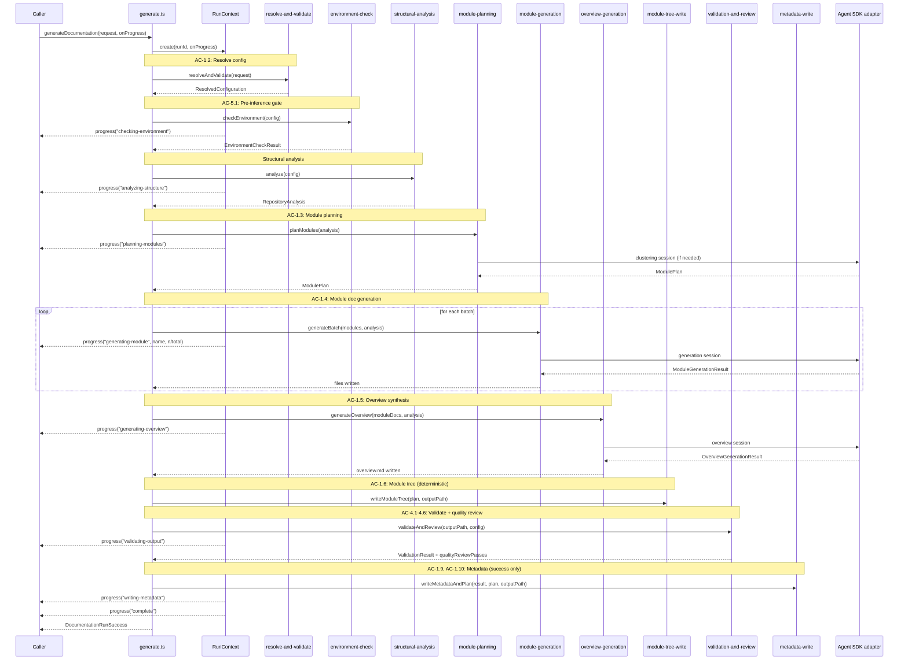
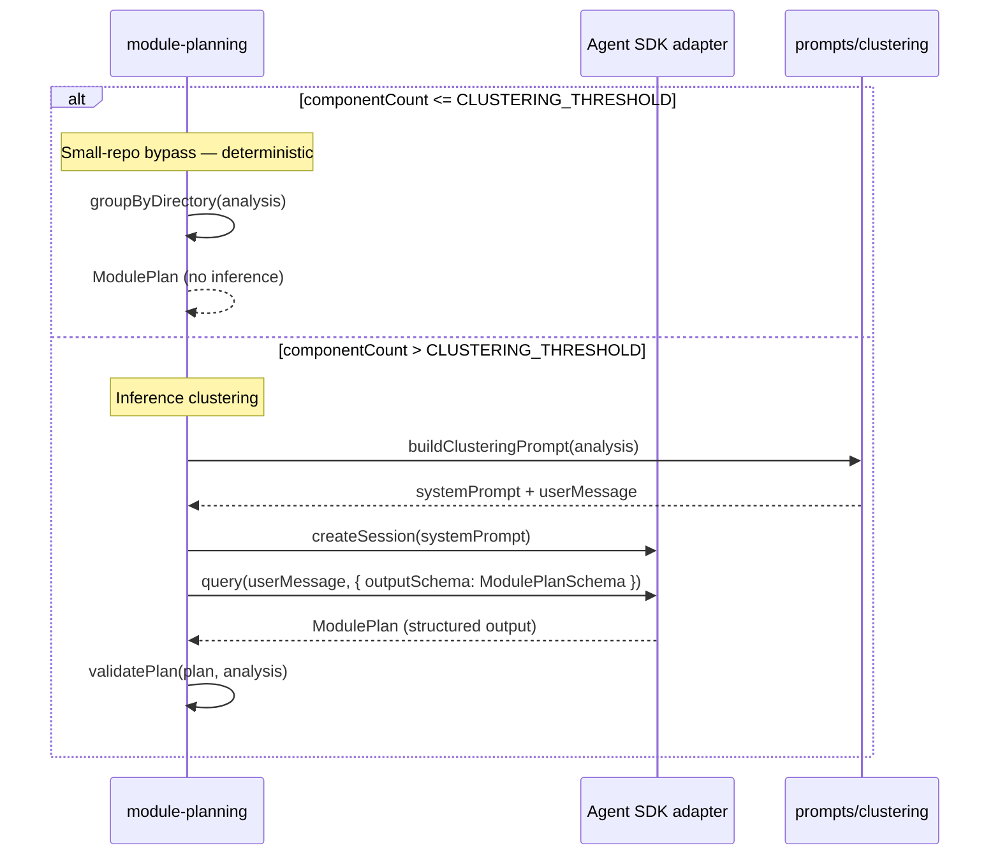
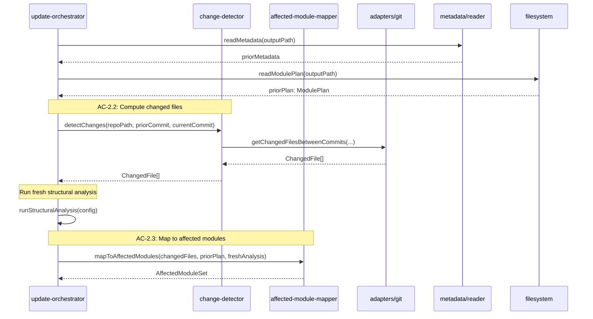

# Technical Design: Generation & Update Orchestration

## Purpose

This document translates Epic 2 requirements into implementable architecture for
the Documentation Engine's inference-driven orchestration layer. It serves three
audiences:

| Audience | Value |
|----------|-------|
| Reviewers | Validate design before code is written |
| Developers | Clear blueprint for implementation |
| Story Tech Sections | Source of implementation targets, interfaces, and test mappings |

**Prerequisite:** Epic 2 (Generation & Update Orchestration) — all ACs have TCs.
Epic 1 tech design complete — this design depends on Epic 1's modules and types.

**Companion Document:** [test-plan.md](test-plan.md) — TC-to-test mapping, fixture
architecture, mock strategy. This design references the test plan rather than
carrying every mapping inline.

---

## Spec Validation

Before designing, validate the epic is implementation-ready.

**Validation Checklist:**

- [x] Every AC maps to clear implementation work
- [x] Data contracts are complete and realistic
- [x] Edge cases have TCs, not just happy path
- [x] No technical constraints the BA missed
- [x] Flows make sense from implementation perspective

**Issues Found:** None blocking. The discriminated union on
`DocumentationRunResult`, the explicit `ModulePlan` persistence, and the bounded
quality review model all map cleanly to implementation.

### Tech Design Questions — Answers

The epic raised nine questions. Here are the design decisions:

| # | Question | Decision | Rationale |
|---|----------|----------|-----------|
| 1 | Agent SDK session boundaries | One session per stage boundary: one for clustering, one per module batch for generation, one for overview, one per quality review pass. Batch size for module generation: up to 3 modules per session for repos ≤15 modules; 1 per session for larger repos. | Short-lived sessions prevent context rot. Batching small repos reduces session overhead. Large repos get isolation per module so one failure doesn't lose the batch. |
| 2 | Oversized module subdivision | Defer to v2. V1 reports oversized modules (>50 components) as warnings. The clustering prompt instructs the model to decompose into sub-modules, but no automated post-hoc splitting occurs. | Post-hoc splitting adds complexity without clear quality gain. Better to let the clustering model decompose upfront and improve the prompt iteratively. |
| 3 | Structured output schemas | Use Agent SDK `outputSchema` for clustering (returns `ModulePlan` shape) and for module generation summaries (returns `ModuleGenerationResult` with `pageContent`, `title`, `crossLinks`). Schema validation failures produce `ORCHESTRATION_ERROR` with the raw response in `details`. | Structured output is the primary path. The fallback (parsing unstructured) is not implemented in v1 — schema failures are errors, not degradation. |
| 4 | Detecting fixable issues for quality review | The engine passes validation findings and the relevant file contents to the review model. No pre-filtering — the model sees all findings and decides what to fix. The system prompt constrains fix scope. | Pre-filtering requires the engine to classify fix difficulty, which is itself an inference task. Let the model handle it with explicit constraints in the prompt. |
| 5 | Second-model review — same or different model? | Same model family, different system prompt emphasizing review-only (no new content). V1 does not use a different model provider. If the generating model is Sonnet, the reviewer is also Sonnet with a review prompt. | Different models add configuration surface and cost unpredictability. Same model with different framing achieves the review perspective without new dependencies. |
| 6 | Cross-session cost tracking | Accumulate token counts per Agent SDK session. Each session returns usage metadata. The orchestrator sums `inputTokens` and `outputTokens` across all sessions, then applies the model's per-token pricing. If any session lacks usage data, `costUsd` is `null` for the entire run. | Partial cost is misleading. Either we have complete cost or we report null. The orchestrator knows which model was used, so pricing is deterministic from token counts. |
| 7 | Major restructuring in update mode | Fall back to a warning recommending full generation. Update mode does not attempt partial re-planning. Heuristic: if >50% of the prior plan's components are affected, or any module loses all its components, add a warning. | Re-planning in update mode breaks the "work within existing plan" constraint from the epic. The heuristic gives callers a signal without over-engineering detection. |
| 8 | Progress event delivery mechanism | Callback function as a separate parameter to `generateDocumentation()`: `onProgress?: (event: DocumentationProgressEvent) => void`. Separate from the request object to keep `DocumentationRunRequest` serializable. Simple, synchronous, no EventEmitter or async iterator overhead. | Callback is the simplest mechanism that satisfies the contract. EventEmitter adds cleanup responsibility. Async iterators add complexity for a stream that's inherently push-based. Code Steward's API route bridges callback → SSE for the browser. |
| 9 | Clustering threshold for small-repo bypass | 8 components. Below this count, the engine creates one module per significant directory (or a single module for flat layouts) without invoking clustering inference. | 8 is approximately 2 modules worth of components. Below this, clustering adds inference cost without meaningful structural insight. The value is a named constant, tunable without code changes. |

---

## Context

Epic 2 is the inference layer of the Documentation Engine. Epic 1 delivered the
deterministic foundation — environment checks, structural analysis, validation,
metadata, and configuration. This epic adds the operations that require judgment:
clustering components into modules, generating documentation content, synthesizing
overviews, and performing bounded quality review.

The primary design challenge is managing the Agent SDK interaction boundary. The
engine must invoke Claude for inference-heavy steps while keeping the overall
workflow bounded and deterministic in structure. Each Agent SDK session is a
potential failure point, a cost center, and a source of variable output. The
architecture isolates these sessions behind a narrow interface so the
orchestration logic can treat them as typed function calls — submit structured
input, receive structured output, handle failure.

The second challenge is update mode. The engine must determine what changed, map
changes to the existing module plan, regenerate only affected modules, and
preserve everything else. This requires a comparison pipeline that runs fresh
analysis, loads the persisted module plan, computes a diff, and produces a
targeted regeneration scope. The epic explicitly constrains update mode: no new
modules, no re-clustering, work within the existing plan. These constraints
simplify the design considerably — update mode is a selective re-execution, not a
re-planning operation.

The third challenge is quality review. The epic caps it at two passes (one
self-review, one optional second-model review), each followed by deterministic
revalidation. The design must ensure this is a straight pipeline, not a loop. No
unbounded iteration, no re-clustering, no architectural changes — just targeted
fixes to obvious validation failures like broken links or malformed Mermaid.

The fourth constraint is cost. Every Agent SDK session contributes to the run's
cost. The engine tracks token usage per session, sums across the run, and reports
best-effort cost in the result. Missing cost data from any session nulls the
entire run's cost — partial cost is worse than no cost.

---

## High Altitude: System View

### System Context

Epic 2 operates within the Documentation Engine SDK, consuming Epic 1 operations
and adding Agent SDK as a new external boundary. The engine becomes a coordinator
between deterministic local operations and inference-driven remote operations.

```text
┌─────────────────────────────────────────────────────────────────┐
│  Callers                                                        │
│  (Code Steward server, CLI, tests)                              │
└──────────────────────┬──────────────────────────────────────────┘
                       │ generateDocumentation(request, onProgress?)
                       ▼
┌─────────────────────────────────────────────────────────────────┐
│  Documentation Engine SDK (Epic 1 + Epic 2)                     │
│                                                                  │
│  ┌───────────────────────────────────────────────────────┐      │
│  │              Orchestration Layer (Epic 2)              │      │
│  │                                                        │      │
│  │  ┌──────────┐ ┌────────────┐ ┌────────────┐          │      │
│  │  │Run       │ │Module      │ │Quality     │          │      │
│  │  │Lifecycle │ │Planning    │ │Review      │          │      │
│  │  └──────────┘ └────────────┘ └────────────┘          │      │
│  │  ┌──────────┐ ┌────────────┐ ┌────────────┐          │      │
│  │  │Module    │ │Overview    │ │Update      │          │      │
│  │  │Generator │ │Generator   │ │Detector    │          │      │
│  │  └──────────┘ └────────────┘ └────────────┘          │      │
│  │  ┌──────────────────────────────────────────┐        │      │
│  │  │         Prompt Builders                   │        │      │
│  │  └──────────────────────────────────────────┘        │      │
│  └───────────────────────────────────────────────────────┘      │
│                                                                  │
│  ┌───────────────────────────────────────────────────────┐      │
│  │           Foundation Layer (Epic 1)                    │      │
│  │  Config │ EnvCheck │ Analysis │ Metadata │ Validation │      │
│  └───────────────────────────────────────────────────────┘      │
│                                                                  │
│  ┌──────────────────── Adapters ─────────────────────────┐      │
│  │  Git  │  Python  │  Filesystem  │  Agent SDK          │      │
│  └───────┴──────────┴──────────────┴─────────────────────┘      │
└─────────────────────────────────────────────────────────────────┘
                       │
           subprocess, fs, Agent SDK network calls
                       ▼
┌─────────────────────────────────────────────────────────────────┐
│  External Systems                                                │
│  Local env (Git, Python, fs)  │  Claude API (via Agent SDK)     │
└─────────────────────────────────────────────────────────────────┘
```

Epic 2 exposes two primary SDK operations, both entering through the
orchestration layer:

| Operation | Input | Output | Epic Flow |
|-----------|-------|--------|-----------|
| `generateDocumentation()` | `DocumentationRunRequest` + optional `onProgress` callback | `DocumentationRunResult` | Flows 1-5 |
| (update is same entry point) | `DocumentationRunRequest` with `mode: "update"` | `DocumentationRunResult` | Flows 2-5 |

The entry point is a single function. The `mode` field determines whether the
full generation or update pipeline executes.

### External Contracts

**New in Epic 2 — Agent SDK boundary:**

| Boundary | Type | Direction | Sessions Per Run |
|----------|------|-----------|-----------------|
| Claude Agent SDK | Network (HTTPS to Claude API) | Engine → Claude | 3-10+ depending on repo size |

**Agent SDK Session Types:**

| Session | Input | Output Schema | Failure Mode |
|---------|-------|---------------|-------------|
| Clustering | `RepositoryAnalysis` + system prompt | `ModulePlan` | `ORCHESTRATION_ERROR` |
| Module generation | Module components + analysis context + system prompt | `ModuleGenerationResult` | `ORCHESTRATION_ERROR` |
| Overview synthesis | Module docs + analysis summary + system prompt | `OverviewGenerationResult` | `ORCHESTRATION_ERROR` |
| Quality review (self) | Validation findings + affected files + system prompt | File patches | `ORCHESTRATION_ERROR` |
| Quality review (second) | Same as self-review, different system prompt | File patches | `ORCHESTRATION_ERROR` |

**Error responses from Agent SDK:**

| Failure Mode | Engine Handling |
|-------------|-----------------|
| Network error | `ORCHESTRATION_ERROR` with network error in details |
| Rate limit | `ORCHESTRATION_ERROR` — no retry in v1 |
| Schema validation failure | `ORCHESTRATION_ERROR` with raw response in details |
| Timeout | `ORCHESTRATION_ERROR` with timeout duration in details |
| Context too large | `ORCHESTRATION_ERROR` — module/batch was too large |

### Runtime Prerequisites (additions to Epic 1)

| Prerequisite | Where Needed | How to Verify |
|---|---|---|
| Valid Claude Agent SDK authentication | All inference operations | Authenticated Agent SDK environment check |
| Network access to Claude API | All inference operations | First session establishment |
| `@anthropic-ai/claude-agent-sdk` | All inference operations | Import check at startup |

### Inherited Toolchain Baseline

Epic 2 inherits the package baseline set in Epic 1 and the dependency decision
document:

| Area | Decision |
|------|----------|
| Runtime target | Node 24 LTS |
| Language | TypeScript 5.9.x |
| Module format | ESM-only with `NodeNext` settings |
| Build | `tsc` |
| Dev execution | `tsx` |
| Testing | Vitest |
| Lint + format | Biome |
| CLI choice | `citty` for the thin CLI surface introduced around this package |
| Contracts | `zod` for runtime schemas/contracts |

Epic 2 should continue preferring Node built-ins for filesystem, path,
subprocess, git, and globbing concerns. The Python analyzer remains in place
under the Epic 1 adapter boundary; Epic 2 builds on that mixed-runtime baseline
without broadening it.

---

## Medium Altitude: Module Architecture

### File Structure (Epic 2 additions)

```text
packages/documentation-engine/
  src/
    index.ts                              # EXTEND: add generateDocumentation export
    types/
      index.ts                            # EXTEND: add new type re-exports
      orchestration.ts                    # NEW: DocumentationRunRequest, RunResult, ProgressEvent, etc.
      planning.ts                         # NEW: ModulePlan, PlannedModule, ClusteringResult
      generation.ts                       # NEW: ModuleGenerationResult, OverviewGenerationResult
      quality-review.ts                   # NEW: QualityReviewConfig, QualityReviewResult
    contracts/
      planning.ts                         # NEW: zod schemas for ModulePlan and clustering output
      generation.ts                       # NEW: zod schemas for module and overview generation output
      quality-review.ts                   # NEW: zod schemas for review patch payloads
    orchestration/
      generate.ts                         # NEW: generateDocumentation() — main entry point
      run-context.ts                      # NEW: RunContext — mutable state for a single run
      stages/
        resolve-and-validate.ts           # NEW: Config resolution + request validation stage
        environment-check.ts              # NEW: Wraps Epic 1 checkEnvironment
        structural-analysis.ts            # NEW: Wraps Epic 1 analyzeRepository
        module-planning.ts                # NEW: Clustering or direct module plan
        module-generation.ts              # NEW: Per-module doc generation with batching
        overview-generation.ts            # NEW: Repo overview synthesis
        module-tree-write.ts              # NEW: Write module-tree.json from plan
        validation-and-review.ts          # NEW: Validation + quality review pipeline
        metadata-write.ts                 # NEW: Wraps Epic 1 writeMetadata
      update/
        change-detector.ts                # NEW: Git diff → changed file set
        affected-module-mapper.ts         # NEW: Changed files → affected modules
        update-orchestrator.ts            # NEW: Update-mode pipeline coordinator
    prompts/
      clustering.ts                       # NEW: System prompt for module clustering
      module-doc.ts                       # NEW: System prompt for module documentation
      overview.ts                         # NEW: System prompt for overview synthesis
      quality-review.ts                   # NEW: System prompt for quality review passes
    # Epic 1 modules unchanged
    config/
    environment/
    analysis/
    metadata/
    validation/
    adapters/
      agent-sdk.ts                        # NEW: Agent SDK wrapper — session management, cost tracking
      git.ts                              # EXTEND: add getChangedFilesBetweenCommits()
      subprocess.ts
      python.ts
  test/
    fixtures/
      agent-sdk/                          # NEW: Mock Agent SDK responses
    helpers/
      agent-sdk-mock.ts                   # NEW: Agent SDK mock utilities
```

### Module Responsibility Matrix

| Module | Responsibility | Dependencies | ACs Covered |
|--------|----------------|--------------|-------------|
| `orchestration/generate.ts` | Main entry point. Validates request, selects full or update pipeline, manages run context, returns result. | `run-context`, all stages, `update-orchestrator` | AC-1.1, AC-1.2 |
| `orchestration/run-context.ts` | Mutable state container for a single run: runId, resolved config, accumulated warnings, cost, progress callback, timing. | Types only | AC-3.3, AC-3.4 |
| `orchestration/stages/resolve-and-validate.ts` | Merges request + config file + defaults. Validates required fields. | Epic 1 `config/resolver` | AC-1.2 |
| `orchestration/stages/environment-check.ts` | Thin wrapper: calls Epic 1 `checkEnvironment`, emits progress, maps failures. | Epic 1 `environment/check` | AC-5.1 (env failure) |
| `orchestration/stages/structural-analysis.ts` | Thin wrapper: calls Epic 1 `analyzeRepository`, emits progress. | Epic 1 `analysis/analyze` | AC-5.1 (analysis failure) |
| `orchestration/stages/module-planning.ts` | Decides: small-repo bypass (direct plan) or inference clustering. Invokes Agent SDK for clustering. Returns `ModulePlan`. | `adapters/agent-sdk`, `prompts/clustering` | AC-1.3 |
| `orchestration/stages/module-generation.ts` | Generates module docs. Batches modules into sessions. Writes `.md` files. Tracks per-module progress. | `adapters/agent-sdk`, `prompts/module-doc`, filesystem | AC-1.4, AC-1.7 |
| `orchestration/stages/overview-generation.ts` | Generates `overview.md` from module docs + analysis summary. Single session. | `adapters/agent-sdk`, `prompts/overview` | AC-1.5 |
| `orchestration/stages/module-tree-write.ts` | Writes `module-tree.json` from the module plan. Deterministic, no inference. | Filesystem | AC-1.6 |
| `orchestration/stages/validation-and-review.ts` | Runs Epic 1 validation → optional self-review → revalidation → optional second-model review → final revalidation. | Epic 1 `validation/validate`, `adapters/agent-sdk`, `prompts/quality-review` | AC-4.1 to AC-4.6, AC-1.8 |
| `orchestration/stages/metadata-write.ts` | Writes `.doc-meta.json` and `.module-plan.json`. Only called on success. | Epic 1 `metadata/writer`, filesystem | AC-1.9, AC-1.10 |
| `orchestration/update/change-detector.ts` | Computes changed files between two commits using `git diff --name-status`. Pure function wrapping git adapter. | `adapters/git` | AC-2.2 |
| `orchestration/update/affected-module-mapper.ts` | Maps changed files to affected modules using the persisted plan and fresh analysis. Detects cross-module relationship changes. | Types only (pure function) | AC-2.3, AC-2.5 |
| `orchestration/update/update-orchestrator.ts` | Update pipeline: load metadata → load plan → detect changes → map to modules → selective generation → overview (if needed) → validate → review → metadata. | All update modules, stages | AC-2.1 to AC-2.8 |
| `prompts/clustering.ts` | Builds system prompt for clustering. Includes analysis summary, component list, relationship graph, focus dirs. | Types only | Supports AC-1.3 |
| `prompts/module-doc.ts` | Builds system prompt for per-module documentation. Includes module components, cross-module context, relationship info. | Types only | Supports AC-1.4 |
| `prompts/overview.ts` | Builds system prompt for overview. Includes module summaries, analysis summary, relationship overview. | Types only | Supports AC-1.5 |
| `prompts/quality-review.ts` | Builds system prompt for quality review. Includes validation findings, affected file contents, fix scope constraints. | Types only | Supports AC-4.2, AC-4.3 |
| `adapters/agent-sdk.ts` | Agent SDK wrapper. Creates sessions, sends prompts, validates structured output, tracks token usage. Exposes typed methods, not raw SDK surface. | `@anthropic-ai/claude-agent-sdk`, `contracts/*` | Supports all inference ACs |
| `adapters/git.ts` (extended) | Add `getChangedFilesBetweenCommits(repoPath, fromCommit, toCommit)`. Returns `ChangedFile[]` with path and change type. | `adapters/subprocess` | AC-2.2 |

### Module Interaction — Full Generation Pipeline

```text
generateDocumentation(request, onProgress)
    │
    ├── 1. resolve-and-validate    →  ResolvedConfiguration
    ├── 2. environment-check       →  EnvironmentCheckResult (abort on failure)
    ├── 3. structural-analysis     →  RepositoryAnalysis (abort on failure)
    ├── 4. module-planning         →  ModulePlan (Agent SDK for clustering)
    ├── 5. module-generation       →  Module .md files written (Agent SDK per batch)
    ├── 6. overview-generation     →  overview.md written (Agent SDK single session)
    ├── 7. module-tree-write       →  module-tree.json written (deterministic)
    ├── 8. validation-and-review   →  ValidationResult (Epic 1 + Agent SDK for review)
    ├── 9. metadata-write          →  .doc-meta.json + .module-plan.json (only on success)
    │
    └── Return DocumentationRunResult
```

### Module Interaction — Update Pipeline

```text
generateDocumentation(request { mode: "update" }, onProgress)
    │
    ├── 1. resolve-and-validate         →  ResolvedConfiguration
    ├── 2. update-orchestrator begins
    │     ├── 2a. read prior metadata   →  GeneratedDocumentationMetadata (abort if missing/invalid)
    │     ├── 2b. read prior plan       →  ModulePlan (abort if missing)
    │     ├── 2c. environment-check     →  (abort on failure)
    │     ├── 2d. structural-analysis   →  Fresh RepositoryAnalysis
    │     ├── 2e. change-detector       →  ChangedFile[] (git diff)
    │     ├── 2f. affected-module-mapper → AffectedModuleSet + warnings
    │     ├── 2g. module-generation     →  Only affected modules regenerated
    │     ├── 2h. overview-generation   →  Only if module structure changed
    │     ├── 2i. module-tree-write     →  Updated tree (if modules removed)
    │     ├── 2j. validation-and-review →  ValidationResult
    │     └── 2k. metadata-write        →  Updated .doc-meta.json + .module-plan.json (and persisted plan changes when needed)
    │
    └── Return DocumentationRunResult (with update-specific fields)
```

---

## Medium Altitude: Flow-by-Flow Design

### Flow 1: Full Generation — Stage Sequence

**Covers:** AC-1.1 through AC-1.10, AC-3.1 through AC-3.4

The full generation flow is a linear pipeline. Each stage has a clear input,
output, and failure mode. The `RunContext` carries mutable state through the
pipeline: accumulated warnings, token counts, progress callback, timing.



**Key design decisions visible in this flow:**

1. **RunContext** carries mutable state. Stages don't share state directly — they
   read/write through the context. This makes stage ordering explicit and
   testable.

2. **Progress events are emitted by the orchestrator**, not by stages. Each stage
   call is preceded by a progress emission. This keeps stages pure and progress
   concerns centralized.

3. **Metadata write is the commit point.** It only happens when the full pipeline
   succeeds. Failed runs leave partial output on disk but no metadata — the prior
   valid state is preserved.

**Skeleton Requirements:**

| What | Path | Stub Signature |
|------|------|----------------|
| Entry point | `src/orchestration/generate.ts` | `export const generateDocumentation = async (request: DocumentationRunRequest, onProgress?: ProgressCallback): Promise<DocumentationRunResult>` |
| Run context | `src/orchestration/run-context.ts` | `export class RunContext { ... }` |
| Resolve stage | `src/orchestration/stages/resolve-and-validate.ts` | `export const resolveAndValidateRequest = async (request: DocumentationRunRequest): Promise<EngineResult<ResolvedRunConfig>>` |
| Env check stage | `src/orchestration/stages/environment-check.ts` | `export const runEnvironmentCheck = async (config: ResolvedRunConfig): Promise<EngineResult<EnvironmentCheckResult>>` |
| Analysis stage | `src/orchestration/stages/structural-analysis.ts` | `export const runStructuralAnalysis = async (config: ResolvedRunConfig): Promise<EngineResult<RepositoryAnalysis>>` |
| Planning stage | `src/orchestration/stages/module-planning.ts` | `export const planModules = async (analysis: RepositoryAnalysis, sdk: AgentSDKAdapter): Promise<EngineResult<ModulePlan>>` |
| Module gen stage | `src/orchestration/stages/module-generation.ts` | `export const generateModuleDocs = async (plan: ModulePlan, analysis: RepositoryAnalysis, config: ResolvedRunConfig, sdk: AgentSDKAdapter, onModuleProgress: ModuleProgressCallback): Promise<EngineResult<GeneratedModuleSet>>` |
| Overview stage | `src/orchestration/stages/overview-generation.ts` | `export const generateOverview = async (moduleDocs: GeneratedModuleSet, analysis: RepositoryAnalysis, config: ResolvedRunConfig, sdk: AgentSDKAdapter): Promise<EngineResult<string>>` |
| Tree write stage | `src/orchestration/stages/module-tree-write.ts` | `export const writeModuleTree = async (plan: ModulePlan, outputPath: string): Promise<EngineResult<void>>` |
| Validation/review | `src/orchestration/stages/validation-and-review.ts` | `export const validateAndReview = async (outputPath: string, config: QualityReviewConfig, sdk: AgentSDKAdapter): Promise<ValidationAndReviewResult>` |
| Metadata stage | `src/orchestration/stages/metadata-write.ts` | `export const writeRunMetadata = async (result: RunSuccessData, plan: ModulePlan, outputPath: string): Promise<EngineResult<void>>` |

---

### Flow 2: Module Planning & Clustering

**Covers:** AC-1.3

Module planning is the first inference-dependent stage. It takes the
`RepositoryAnalysis` from Epic 1 and produces a `ModulePlan` — the structural
blueprint for all subsequent generation.

Two paths exist: the small-repo bypass (deterministic) and inference clustering
(Agent SDK session).

**Small-repo bypass (≤ CLUSTERING_THRESHOLD components):**

The engine groups components by significant directory path (first two path
segments after `src/` or the repo root). Each group becomes a module. Components
that don't fit a clear group become `unmappedComponents`. No Agent SDK call.

**Inference clustering (> CLUSTERING_THRESHOLD components):**

The engine invokes a clustering session with the full analysis. The system prompt
includes the component list (file paths, exported symbols, line counts),
relationship graph (imports, usage), and focus directories. The model returns a
`ModulePlan` via structured output.



**Plan validation (post-clustering):** After inference returns a plan, the engine
validates it: every component should appear in exactly one module or in
`unmappedComponents`, module names should be unique, and no module should be
empty. Validation failures are `ORCHESTRATION_ERROR` — the model produced an
invalid plan.

---

### Flow 3: Module Documentation Generation

**Covers:** AC-1.4, AC-1.7

Module generation is the longest stage by wall-clock time. Each module (or batch
of modules) requires an Agent SDK session. The engine writes a markdown file per
module to the output directory.

**Batching strategy:**

| Repo Size | Batch Size | Rationale |
|-----------|------------|-----------|
| ≤ 15 modules | Up to 3 per session | Reduces session overhead for small repos |
| > 15 modules | 1 per session | Isolation prevents one failure from losing a batch |

Within each session, the module generation prompt includes:

- The module's components (file paths, exported symbols, line counts)
- Cross-module relationship context (which other modules this one depends on and
  is depended on by)
- The analysis summary for repo-level context
- Focus directory annotations if the module is in a focus area

The model returns a `ModuleGenerationResult` via structured output containing the
page content (markdown), the page title, and suggested cross-links to other
modules.

**File naming:** Module page filenames are derived from module names by
lowercasing, replacing spaces with hyphens, and removing special characters. The
derivation function is deterministic and exported for testing.

---

### Flow 4: Quality Review Pipeline

**Covers:** AC-4.1 through AC-4.6

Quality review is a bounded pipeline, not an iterative loop. The structure is
fixed at build time:

```text
Generate/Update output
    │
    ├── 1. Run Epic 1 validation
    │       └── No issues? → Done (skip review)
    │
    ├── 2. Self-review enabled?
    │       ├── Yes → Run self-review pass (1 Agent SDK session)
    │       │         └── Rerun Epic 1 validation
    │       └── No → Skip
    │
    ├── 3. Second-model review enabled AND issues remain?
    │       ├── Yes → Run second-model pass (1 Agent SDK session)
    │       │         └── Rerun Epic 1 validation
    │       └── No → Skip
    │
    └── 4. Return final ValidationResult + pass count
```

**What the review model receives:**

- All validation findings (not pre-filtered)
- The full contents of files referenced in findings
- A system prompt that explicitly constrains fix scope: broken links, missing
  pages/sections, malformed Mermaid, thin summaries. No re-clustering, no new
  content generation, no structural changes.

**What the review model returns:**

File patches — a list of `{ filePath, newContent }` pairs. The engine writes the
patched files, then reruns deterministic validation.

---

### Flow 5: Update Mode — Change Detection and Mapping

**Covers:** AC-2.1 through AC-2.8

Update mode is a selective re-execution of the generation pipeline. The key
difference is the change detection and module mapping stage that determines
which modules need regeneration.



**`AffectedModuleSet` structure:**

```typescript
interface AffectedModuleSet {
  modulesToRegenerate: string[];       // module names
  modulesToRemove: string[];           // modules whose files are all deleted
  unchangedModules: string[];          // not affected
  unmappableFiles: string[];           // new files that can't map to existing modules
  overviewNeedsRegeneration: boolean;  // true when modules removed
  warnings: string[];                  // diagnostic warnings
}
```

**Mapping rules (from epic, codified here):**

1. Changed file in prior plan → that module is affected
2. Changed file was in `unmappedComponents` → warning, not regenerated
3. New file mappable to existing module (fresh analysis + directory match) → that
   module is affected
4. New file not mappable → warning, recommend full generation
5. Deleted file → that module is affected; if all files in module deleted →
   module removed
6. Relationship change (new import from module A to module B) → both A and B
   affected

Rule 6 (cross-module relationships) is detected by comparing the relationship
sets in the prior plan's analysis context against the fresh analysis. The mapper
checks: for each changed file, are there new or removed relationships to files
in other modules?

---

## Low Altitude: Interface Definitions

### Orchestration Types

```typescript
// types/orchestration.ts

/**
 * Callback for progress events. Synchronous — caller should not block.
 */
export type ProgressCallback = (event: DocumentationProgressEvent) => void;

/**
 * Resolved run configuration. Extends ResolvedConfiguration with
 * run-specific fields from the request.
 *
 * Produced by resolve-and-validate stage.
 */
export interface ResolvedRunConfig extends ResolvedConfiguration {
  repoPath: string;
  mode: "full" | "update";
  qualityReview: Required<QualityReviewConfig>;
}

/**
 * Result of the validation-and-review pipeline.
 */
export interface ValidationAndReviewResult {
  validationResult: ValidationResult;
  qualityReviewPasses: number;
  /** true if final validation has errors */
  hasBlockingErrors: boolean;
}
```

### Planning Types

```typescript
// contracts/planning.ts

import { z } from "zod";

/**
 * Named constant for the small-repo clustering bypass threshold.
 * Below this count, no inference clustering is invoked.
 */
export const CLUSTERING_THRESHOLD = 8;

/**
 * Named constant for batch size decisions.
 */
export const LARGE_REPO_MODULE_THRESHOLD = 15;

/**
 * zod schema for Agent SDK structured output from clustering session.
 * Used as the runtime contract for outputSchema validation.
 */
export const modulePlanSchema = z.object({
  modules: z.array(
    z.object({
      name: z.string().min(1),
      description: z.string().min(1),
      components: z.array(z.string()),
      parentModule: z.string().optional(),
    })
  ),
  unmappedComponents: z.array(z.string()),
});

export type ModulePlan = z.infer<typeof modulePlanSchema>;
```

### Generation Types

```typescript
// types/generation.ts

/**
 * Result from a single module generation session.
 * Returned via Agent SDK structured output.
 */
export interface ModuleGenerationResult {
  pageContent: string;       // Full markdown content for the module page
  title: string;             // Module page title
  crossLinks: string[];      // Suggested links to other module pages
}

/**
 * Result from overview generation session.
 */
export interface OverviewGenerationResult {
  content: string;           // Full markdown content for overview.md
  mermaidDiagram: string;    // Mermaid diagram source (included in content)
}

/**
 * Set of generated module documents, keyed by module name.
 */
export type GeneratedModuleSet = Map<string, GeneratedModulePage>;

export interface GeneratedModulePage {
  moduleName: string;
  fileName: string;          // e.g., "core.md"
  content: string;
  filePath: string;          // absolute path where written
}

/**
 * Derives a filename from a module name.
 * Lowercase, hyphens for spaces, strip special chars, add .md.
 *
 * Deterministic and exported for testing.
 */
export const moduleNameToFileName = (name: string): string => {
  return name
    .toLowerCase()
    .replace(/\s+/g, "-")
    .replace(/[^a-z0-9-]/g, "")
    .concat(".md");
};
```

### Quality Review Types

```typescript
// types/quality-review.ts

/**
 * A file patch proposed by the quality review model.
 */
export interface ReviewFilePatch {
  filePath: string;          // relative to output directory
  newContent: string;        // complete new file content
}

/**
 * Result from a single quality review pass.
 */
export interface QualityReviewPassResult {
  patchesApplied: number;
  filesModified: string[];
}
```

### Update Types

```typescript
// types/update.ts (inside orchestration.ts or separate)

/**
 * A file changed between two commits.
 */
export interface ChangedFile {
  path: string;
  changeType: "added" | "modified" | "deleted" | "renamed";
  oldPath?: string;          // present when changeType is "renamed"
}

/**
 * Result of mapping changed files to affected modules.
 *
 * Supports: AC-2.3 (mapping), AC-2.5 (structural changes), AC-2.6 (overview)
 */
export interface AffectedModuleSet {
  modulesToRegenerate: string[];
  modulesToRemove: string[];
  unchangedModules: string[];
  unmappableFiles: string[];
  overviewNeedsRegeneration: boolean;
  warnings: string[];
}
```

### Agent SDK Adapter Interface

```typescript
// adapters/agent-sdk.ts

/**
 * Agent SDK adapter. Wraps @anthropic-ai/claude-agent-sdk with:
 * - Session creation and lifecycle management
 * - Structured output schema enforcement
 * - Token usage tracking per session
 * - Typed error mapping to EngineError
 *
 * This is the ONLY module that imports the Agent SDK directly.
 * All other modules interact through this adapter.
 */
export interface AgentSDKAdapter {
  /**
   * Create a session and send a query with structured output.
   * Returns the parsed, schema-validated response.
   *
   * @throws Never — returns EngineResult on all paths
   */
  query<T>(options: AgentQueryOptions): Promise<EngineResult<AgentQueryResult<T>>>;

  /**
   * Get accumulated token usage across all sessions.
   */
  getAccumulatedUsage(): TokenUsage;

  /**
   * Compute cost from accumulated usage. Returns null if any
   * session lacked usage data.
   */
  computeCost(): number | null;
}

export interface AgentQueryOptions {
  systemPrompt: string;
  userMessage: string;
  outputSchema?: Record<string, unknown>;
  model?: string;            // defaults to configured model
  maxTokens?: number;
  /** Working directory for the agent session */
  cwd?: string;
  /** File paths the agent is allowed to read */
  allowedPaths?: string[];
}

export interface AgentQueryResult<T> {
  output: T;
  usage: TokenUsage | null;
}

export interface TokenUsage {
  inputTokens: number;
  outputTokens: number;
}

/**
 * Factory function. Creates an AgentSDKAdapter instance.
 * Separated from the interface for testability — tests provide
 * a mock adapter, production provides the real one.
 */
export const createAgentSDKAdapter = (): AgentSDKAdapter => {
  throw new NotImplementedError("createAgentSDKAdapter");
};
```

### Git Adapter Extension

```typescript
// adapters/git.ts (additions to Epic 1)

/**
 * Returns files changed between two commits.
 * Uses `git diff --name-status fromCommit toCommit`.
 *
 * Supports: AC-2.2
 */
export const getChangedFilesBetweenCommits = async (
  repoPath: string,
  fromCommit: string,
  toCommit: string
): Promise<ChangedFile[]> => {
  throw new NotImplementedError("getChangedFilesBetweenCommits");
};
```

### RunContext

```typescript
// orchestration/run-context.ts

/**
 * Mutable state for a single documentation run.
 * Created at run start, passed through all stages, consumed at result assembly.
 *
 * Not a God object — it's a data bag. Stages read/write specific fields.
 * The orchestrator creates and destroys it.
 */
export class RunContext {
  readonly runId: string;
  readonly startTime: number;
  readonly mode: "full" | "update";

  private warnings: string[] = [];
  private onProgress: ProgressCallback | undefined;
  private sdkAdapter: AgentSDKAdapter;

  constructor(mode: "full" | "update", onProgress?: ProgressCallback);

  /** Emit a progress event to the caller */
  emitProgress(stage: DocumentationStage, extra?: Partial<DocumentationProgressEvent>): void;

  /** Add a warning to the accumulated list */
  addWarning(message: string): void;

  /** Get the Agent SDK adapter for this run */
  getSDK(): AgentSDKAdapter;

  /** Assemble the final result */
  assembleSuccessResult(data: RunSuccessData): DocumentationRunSuccess;
  assembleFailureResult(stage: DocumentationStage, error: EngineError): DocumentationRunFailure;
}
```

### SDK Public Surface (Epic 2 addition)

```typescript
// index.ts additions

export { generateDocumentation } from "./orchestration/generate.js";

// Re-export new types
export type {
  DocumentationRunRequest,
  DocumentationRunResult,
  DocumentationRunSuccess,
  DocumentationRunFailure,
  DocumentationProgressEvent,
  DocumentationStage,
  ModulePlan,
  PlannedModule,
  QualityReviewConfig,
  ProgressCallback,
} from "./types/index.js";
```

---

## Architecture Decisions

### AD-6: Single Entry Point for Generate and Update

**Decision:** One function `generateDocumentation()` handles both modes. The
`mode` field on the request selects the pipeline.

**Rationale:** The caller's mental model is "run documentation." Whether it's
full or update is a parameter, not a different operation. Internally, the
orchestrator delegates to the appropriate pipeline, but the public surface stays
simple.

### AD-7: RunContext as Mutable State Container

**Decision:** A `RunContext` class carries mutable state (warnings, timing,
progress callback) through the pipeline. Stages receive it as a parameter.

**Rationale:** Stages need to accumulate warnings and emit progress without
returning them as part of their typed result. A context object is simpler than
threading multiple accumulators through every stage. It's a data bag, not a
service — no business logic lives in RunContext.

### AD-8: Agent SDK Adapter as Dependency Injection

**Decision:** The Agent SDK is accessed through an `AgentSDKAdapter` interface.
The orchestrator creates the real adapter; tests provide a mock.

**Rationale:** Unlike Epic 1's module-level adapter boundary (where only one
implementation exists), the Agent SDK adapter needs to be mockable per-test
with different response fixtures. An interface with constructor injection is
the simplest way to achieve this. The adapter is the ONLY module that imports
`@anthropic-ai/claude-agent-sdk`.

### AD-9: Callback-Based Progress Events

**Decision:** Progress events use a callback function
`onProgress?: (event: DocumentationProgressEvent) => void` as a separate parameter
to `generateDocumentation()`.

**Rationale:** Callback is the simplest mechanism. EventEmitter adds cleanup.
Async iterators add complexity for push-based events. The callback is
synchronous — the caller should not block in it. Code Steward's API route
bridges callback → SSE for the browser.

### AD-10: All-or-Nothing Cost Tracking

**Decision:** If any Agent SDK session within a run lacks token usage data,
`costUsd` is `null` for the entire run.

**Rationale:** Partial cost data is misleading. A run with 5 sessions where one
lacks usage would report ~80% of the real cost, which could lead to budgeting
errors. Better to report null and let the caller know cost was unavailable.

### AD-11: Quality Review via File Patches

**Decision:** The quality review model returns complete file contents for files
it modifies. The engine writes them directly.

**Rationale:** Diff-based patches are fragile — line number offsets, context
matching issues. Complete file replacement is simpler and more reliable when the
files are small (generated markdown pages). The downside (transmitting full file
content) is negligible for documentation-sized files.

---

## Verification Scripts

Epic 2 uses the same verification scripts from Epic 1's `package.json`. The
baseline remains:

- `build`: `tsc -p tsconfig.json`
- `dev`: `tsx src/index.ts`
- `typecheck`: `tsc --noEmit`
- `lint`: `biome check .`
- `test`: `vitest run`
- `verify`: `biome check . && tsc --noEmit && vitest run`

Epic 2 adds more Vitest suites and mock fixtures, but it does not change the
package tooling stack.

---

## Work Breakdown: Chunks

### Chunk 0: Orchestration Infrastructure

Types, `RunContext`, progress event types, `DocumentationRunRequest` and
`DocumentationRunResult` types (including the discriminated union), `ModulePlan`
and `PlannedModule` types, `QualityReviewConfig`, `ORCHESTRATION_ERROR` code
addition, Agent SDK adapter interface, mock Agent SDK response fixtures, module
name → filename derivation utility. No TDD cycle — pure infrastructure.

| Deliverable | Path |
|-------------|------|
| Orchestration types | `src/types/orchestration.ts` |
| Planning types | `src/types/planning.ts` |
| Generation types | `src/types/generation.ts` |
| Quality review types | `src/types/quality-review.ts` |
| `RunContext` class | `src/orchestration/run-context.ts` |
| Agent SDK adapter interface | `src/adapters/agent-sdk.ts` |
| `moduleNameToFileName` utility | `src/types/generation.ts` |
| `CLUSTERING_THRESHOLD` constant | `src/types/planning.ts` |
| Mock Agent SDK fixtures | `test/fixtures/agent-sdk/` |
| Mock Agent SDK helper | `test/helpers/agent-sdk-mock.ts` |
| `ORCHESTRATION_ERROR` code | `src/types/common.ts` (extend) |

**Exit Criteria:** The `typecheck` script (`tsc --noEmit`) passes. All new types importable. Mock
fixtures structured and loadable.

### Chunk 1: Module Planning

**Scope:** Small-repo bypass + inference clustering + plan validation.
**ACs:** AC-1.3
**TCs:** TC-1.3a through TC-1.3d (4 TCs)
**Relevant Tech Design Sections:** §Flow 2: Module Planning & Clustering,
§Low Altitude: Planning Types, §AD-8: Agent SDK Adapter
**Non-TC Decided Tests:** Clustering returns invalid plan (component in two
modules); clustering returns empty modules array; plan validation rejects
duplicate module names; small-repo bypass with flat directory layout (no `src/`).
Prompt builder structural tests: clustering prompt includes component list and
relationship graph; module-doc prompt includes cross-module context; overview
prompt includes module summaries; quality-review prompt includes fix scope
constraints and validation findings (6 prompt tests).

**Test Count:** 4 TC tests + 10 non-TC = 14 tests
**Running Total:** 14 tests

### Chunk 2: Core Generation Pipeline

**Scope:** Module generation + overview synthesis + tree write + entry point wiring.
**ACs:** AC-1.1, AC-1.2, AC-1.4, AC-1.5, AC-1.6, AC-1.7, AC-1.8, AC-1.9, AC-1.10
**TCs:** TC-1.1a through TC-1.10b (18 TCs, excluding AC-1.3 which is Chunk 1)
**Relevant Tech Design Sections:** §Flow 1: Full Generation Stage Sequence,
§Flow 3: Module Documentation Generation, §Low Altitude: Generation Types,
§AD-6: Single Entry Point, §AD-7: RunContext
**Non-TC Decided Tests:** Module generation session timeout; overview generation
with zero cross-links; file naming collision (two modules produce same filename);
empty module plan (edge case); output directory doesn't exist (should create).

**Test Count:** 18 TC tests + 5 non-TC = 23 tests
**Running Total:** 37 tests

### Chunk 3: Progress & Result Assembly

**Scope:** Full-generation progress event emission, success-path result assembly, and cost tracking.
**ACs:** AC-1.1, AC-3.1, AC-3.2, AC-3.3, AC-3.4
**TCs:** TC-1.1b, TC-3.1a, TC-3.1b, TC-3.2a, and TC-3.3a through TC-3.4d (9 TCs)
**Relevant Tech Design Sections:** §Flow 1: Stage Sequence (progress annotations),
§Low Altitude: Orchestration Types, §AD-9: Callback Progress, §AD-10: Cost
**Non-TC Decided Tests:** No progress callback provided (should not error);
progress event timestamp ordering; cost with mixed available/unavailable sessions.

**Test Count:** 9 TC tests + 3 non-TC = 12 tests
**Running Total:** 49 tests

### Chunk 4: Validation & Quality Review

**Scope:** Post-generation validation integration, self-review pass, second-model
review pass, revalidation pipeline.
**ACs:** AC-1.8, AC-4.1 through AC-4.6
**TCs:** TC-1.8b, TC-1.8c, TC-4.1a, and TC-4.2a through TC-4.6c (18 TCs, with TC-1.8b/c co-validated by the TC-4.6b/c result-state tests)
**Relevant Tech Design Sections:** §Flow 4: Quality Review Pipeline,
§Low Altitude: Quality Review Types, §AD-11: File Patches
**Non-TC Decided Tests:** Quality-review progress event emitted when a review
pass runs; review model returns patches for files not in output (rejected);
review model returns empty patches (no-op); self-review timeout; second-model
review disabled by default in QualityReviewConfig.

**Test Count:** 16 TC tests + 5 non-TC = 21 tests
**Running Total:** 70 tests

### Chunk 5: Incremental Update

**Scope:** Change detection, affected-module mapping, selective regeneration,
overview regeneration triggers, update-specific progress/result behavior, and
post-update validation reuse.
**ACs:** AC-2.1 through AC-2.8, AC-3.1, AC-3.2, AC-4.1
**TCs:** TC-2.1a through TC-2.8a, TC-3.1c, TC-3.2b, and TC-4.1b (24 TCs)
**Relevant Tech Design Sections:** §Flow 5: Update Mode, §Low Altitude: Update
Types, §Git Adapter Extension
**Non-TC Decided Tests:** >50% components affected triggers recommendation
warning; renamed file correctly maps to module; change detection with merge
commits; fresh analysis detects new relationship between unchanged files.

**Test Count:** 24 TC tests + 4 non-TC = 28 tests
**Running Total:** 98 tests

### Chunk 6: Recovery & Failure Handling

**Scope:** Per-stage failure handling, partial output preservation, failed
progress event, discriminated union result assembly for all failure modes.
**ACs:** AC-5.1 through AC-5.5, AC-3.5
**TCs:** TC-5.1a through TC-5.5a (10 TCs), plus TC-3.5a (11 TCs total)
**Relevant Tech Design Sections:** §External Contracts: Error Responses,
§Low Altitude: RunContext (assembleFailureResult)
**Non-TC Decided Tests:** Double failure (stage fails, then progress emission
fails); failure at metadata-write stage; Agent SDK network timeout at different
stages.

**Test Count:** 11 TC tests + 3 non-TC = 14 tests
**Running Total:** 112 tests (includes 6 prompt builder tests in Chunk 1)

### Chunk Dependencies

```text
Chunk 0 (Orchestration Infrastructure)
    ↓
Chunk 1 (Module Planning)
    ↓
Chunk 2 (Core Generation Pipeline)
    ├──→ Chunk 3 (Progress & Result Assembly)
    └──→ Chunk 4 (Validation & Quality Review)
              ↓
         Chunk 5 (Incremental Update)
              ↓
         Chunk 6 (Recovery & Failure Handling)
```

Chunk 3 and 4 can proceed in parallel after Chunk 2. Chunk 5 depends on Chunk 4
(quality review is part of the update pipeline). Chunk 6 wires failure handling
across all flows and should be last.

---

## Deferred Items

| Item | Related AC | Reason Deferred | Future Work |
|------|-----------|-----------------|-------------|
| Oversized module auto-splitting | AC-1.3 | V1 warns on >50 components per module; prompt handles decomposition | Evaluate after observing clustering quality on real repos |
| Unstructured output fallback | AC-1.4 | Schema failures are errors in v1 | Add regex-based markdown extraction if schema failures are common |
| Retry on Agent SDK rate limits | AC-5.2 | Adds retry/backoff complexity | Add after measuring rate limit frequency in production use |
| Different model for second-model review | AC-4.5 | Configuration surface overhead | Add if same-model review proves insufficient |
| Streaming progress during Agent SDK sessions | AC-3.2 | Agent SDK may support streaming; v1 uses post-session progress | Add when Agent SDK streaming API is stable |

---

## Related Documentation

- **Epic:** [epic.md](epic.md)
- **Test Plan:** [test-plan.md](test-plan.md)
- **Epic 1 Tech Design:** [../epic-1/tech-design.md](../epic-1/tech-design.md)
- **Epic 1 Test Plan:** [../epic-1/test-plan.md](../epic-1/test-plan.md)
- **Technical Architecture:** `../technical-architecture.md`
- **Documentation Engine PRD:** `../PRD.md`

---

## Self-Review Checklist

### Completeness

- [x] Every TC from epic mapped to a test file (see test plan)
- [x] All interfaces fully defined (types, function signatures, adapter interfaces)
- [x] Module boundaries clear — no ambiguity about what lives where
- [x] Chunk breakdown includes test count estimates and relevant tech design section references
- [x] Non-TC decided tests identified and assigned to chunks
- [x] Skeleton stubs are copy-paste ready

### Richness (The Spiral Test)

- [x] Context section is 4 paragraphs establishing constraints and challenges
- [x] External contracts from High Altitude appear in adapter interfaces
- [x] Module descriptions include AC coverage references
- [x] Interface definitions include AC/TC coverage references
- [x] Flows reference Context (why) and Interfaces (how)
- [x] Someone could enter at any section and navigate to related content

### Architecture Gate

- [x] Verification scripts defined (inherited from Epic 1)
- [x] Test segmentation strategy decided (service mocks with mocked Agent SDK)
- [x] Error contract extended (`ORCHESTRATION_ERROR`)
- [x] Runtime prerequisites documented (Agent SDK, authentication, network)
- [x] All 9 tech design questions from epic answered
