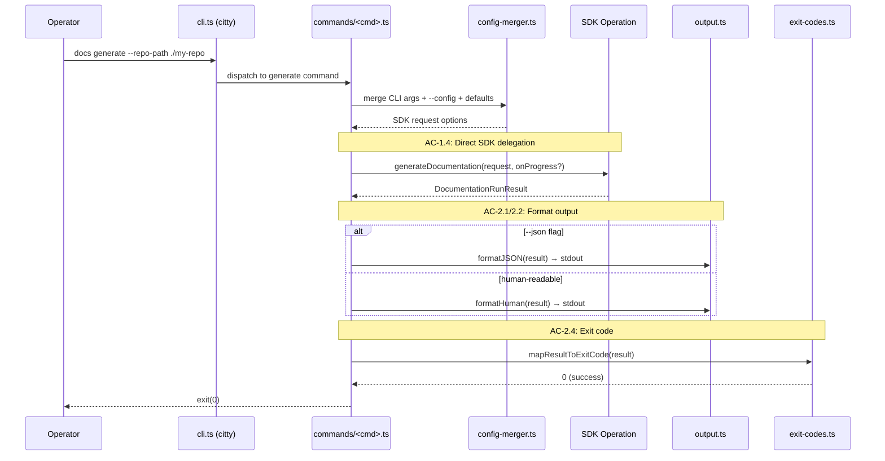
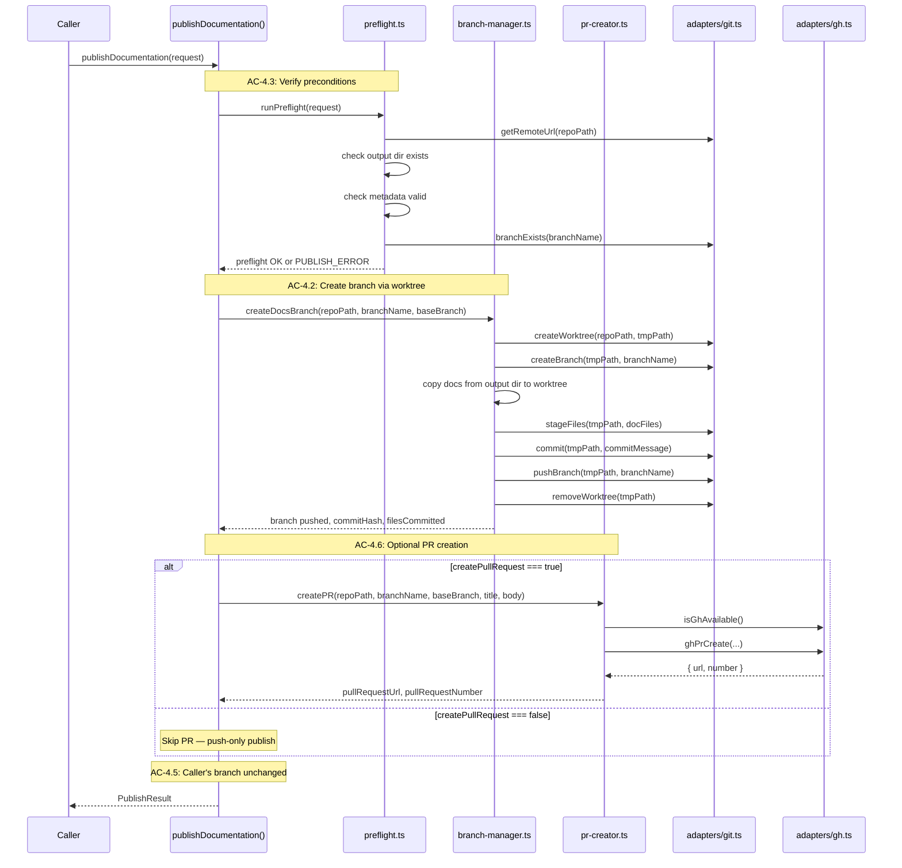

# Technical Design: CLI & Code Steward Integration

## Purpose

This document translates Epic 3 requirements into implementable architecture for
the Documentation Engine's consumer-facing surfaces: the thin CLI, the public SDK
integration contract, the publish workflow, and the test/eval harness. It serves
three audiences:

| Audience | Value |
|----------|-------|
| Reviewers | Validate design before code is written |
| Developers | Clear blueprint for implementation |
| Story Tech Sections | Source of implementation targets, interfaces, and test mappings |

**Prerequisite:** Epic 3 (CLI & Code Steward Integration) — all ACs have TCs.
Epic 1 and Epic 2 tech designs complete — this design depends on both layers.

**Companion Document:** [test-plan.md](test-plan.md) — TC-to-test mapping, fixture
architecture, mock strategy, CI considerations. This design references the test
plan rather than carrying every mapping inline.

---

## Spec Validation

Before designing, validate the epic is implementation-ready.

**Validation Checklist:**

- [x] Every AC maps to clear implementation work
- [x] Data contracts are complete and realistic
- [x] Edge cases have TCs, not just happy path
- [x] No technical constraints the BA missed
- [x] Flows make sense from implementation perspective

**Issues Found:** None blocking. The epic's Story 2/3 boundary tightening,
the explicit output-path-centric `validate` design, and the publish branch
preservation guarantee are all well-defined for implementation.

### Tech Design Questions — Answers

The epic raised eight questions. Here are the design decisions:

| # | Question | Decision | Rationale |
|---|----------|----------|-----------|
| 1 | CLI binary packaging and invocation path with `tsc` | `src/cli.ts` compiles to `dist/cli.js` via `tsc`. `package.json` `bin` field maps `docs` to `./dist/cli.js`. The file starts with `#!/usr/bin/env node`. Invocable via `npx docs`, `node dist/cli.js`, or bin symlink after install/link. | Standard Node binary pattern. `tsc` handles the compilation; no bundler needed. The `bin` field is the Node convention for CLI tools. |
| 2 | Progress rendering strategy in terminal output | Sequential log lines to stderr. Each stage prints `→ Stage name...`. Module progress prints `→ Generating module: core (2/5)`. No line clearing, no spinner, no terminal capability detection. JSON mode suppresses stderr entirely. | Sequential lines work in all terminals, pipe correctly, and are simplest to implement. Clearing lines adds `readline` complexity and breaks in non-TTY contexts. Stderr keeps progress separate from stdout result. |
| 3 | Publish implementation location and adapter boundaries | New `src/publish/` module. Git operations extend `adapters/git.ts` with branch, commit, push, and worktree helpers. `gh` CLI calls go through a new `adapters/gh.ts`. The `publishDocumentation()` function lives in `src/publish/publish.ts` and orchestrates the publish stages using these adapters. It is re-exported from `src/index.ts`. | Publish is a separate concern from generation. The adapter pattern keeps git and gh subprocess calls testable. The publish function follows the same pattern as `generateDocumentation()` — a high-level orchestrator that composes adapter calls. |
| 4 | Public package `exports` shape | Single entry point. `package.json` `exports` maps `"."` to `{ "types": "./dist/index.d.ts", "import": "./dist/index.js" }`. No subpath exports in v1. All operations and types re-exported from `src/index.ts`. | Single entry point is the simplest correct approach. Subpath exports add configuration surface without v1 benefit. Code Steward imports from the package root: `import { generateDocumentation } from "documentation-engine"`. |
| 5 | `--config` path resolution behavior | `--config` accepts an absolute or relative path. Relative paths resolve against `process.cwd()`, not against `--repo-path`. If `--config` is not provided, the Epic 1 config resolution applies: `.docengine.json` in repo root → built-in defaults. | CWD resolution matches how every other CLI tool handles relative paths (git, tsc, biome). Resolving against repo-path would be surprising. The config file search in repo root is the engine's ambient config mechanism — `--config` is the explicit override. |
| 6 | Base branch detection for publish | Auto-detect via `git symbolic-ref refs/remotes/origin/HEAD`. Fallback: check for `main`, then `master`. Caller can override with explicit `baseBranch`. Detection is cached per publish operation, not across operations. | `symbolic-ref` returns the remote's default branch without network access (uses local remote tracking). The `main` → `master` fallback covers repos where `origin/HEAD` is not set. Explicit override covers enterprise branch naming conventions. |
| 7 | Ctrl+C behavior for long-running commands | Register a `SIGINT` handler that sets a cancellation flag on the active operation. Between stages, the orchestrator checks this flag and exits early. During an Agent SDK session, the current session completes but no new sessions start. CLI exits with code 130 (128 + SIGINT). No cleanup of partial output — matches Epic 2's behavior where failed runs leave partial output without metadata. | Code 130 is the Unix convention for SIGINT termination. Completing the current session avoids leaving the Agent SDK in an undefined state. No cleanup matches the existing failure model — metadata is only written on success, so partial state is always inspectable. |
| 8 | Fixture reuse and new fixtures for Epic 3 | Reuse all Epic 1/2 fixture repos (`valid-ts`, `empty`, `multi-lang`) and doc output fixtures (`valid`, `broken-links`, etc.). New fixtures: `test/fixtures/publish/` with a bare git repo as remote target; CLI smoke test wrapper scripts; pre-built documentation output for publish flow tests. | Fixture reuse avoids duplication and ensures Epic 3 tests exercise the same data that Epic 1/2 validated. New publish fixtures are required because publish needs a pushable remote — a bare repo serves this purpose in tests without requiring network access. |

---

## Context

Epic 3 is the consumer-facing surface of the Documentation Engine. Epic 1
delivered the deterministic foundation. Epic 2 added inference-driven generation
and update pipelines. This epic exposes those capabilities through the surfaces
that actual users interact with — the CLI, the application integration contract,
the publish workflow — and ensures the engine is verifiable outside the Code
Steward application.

The primary design constraint is thinness. The CLI is a shell: argument parsing
→ config resolution → SDK call → output formatting → exit code. It must not
contain orchestration logic, prompt construction, or generation behavior. Every
CLI command maps 1:1 to an SDK function. If a CLI test and an SDK test produce
different results for the same inputs, that is a bug in the CLI, not in the SDK.

The second constraint is the structured-data contract. Code Steward consumes the
engine as an imported package. It calls typed functions, receives typed results,
and uses those results to render UI and persist state. Code Steward never parses
console output, reads side-effect files, or inspects stderr. The engine's public
surface must be complete enough that the caller's only filesystem interaction is
the initial repo clone managed by Code Steward's own infrastructure.

The third constraint is publish isolation. Publish operates on existing
documentation output — it does not trigger generation. It creates a branch,
commits files, pushes, and optionally opens a PR. The caller's current branch
context must be preserved throughout. This requires a mechanism (git worktree)
that operates without disturbing the main checkout. Failed publishes must leave
a clean, inspectable state.

The fourth constraint is testability without the application. CLI commands must
be exercisable against fixture repos. SDK operations must be callable from
standalone test suites. The engine must be verifiable by a tech lead who does
not have Code Steward running. This means the package entry point, the CLI
binary, and the fixture repos together form a self-contained verification
surface.

---

## High Altitude: System View

### System Context

Epic 3 adds two new consumer surfaces (CLI and public SDK entry point) and one
new external boundary (GitHub CLI for publish). It completes the system picture:

```text
┌──────────────────────────────────────────────────────────────────────────┐
│  Consumer Surfaces                                                       │
│                                                                          │
│  ┌──────────────────┐  ┌──────────────────────┐  ┌──────────────────┐  │
│  │  CLI Operator     │  │  Code Steward Server  │  │  Test Suites     │  │
│  │  (manual / script)│  │  (API routes)          │  │  (Vitest)        │  │
│  └────────┬─────────┘  └──────────┬─────────────┘  └──────┬───────────┘  │
│           │ CLI binary              │ package import        │ package import│
│           │ (docs <cmd>)            │                       │              │
└───────────┼─────────────────────────┼───────────────────────┼──────────────┘
            │                         │                       │
            ▼                         ▼                       ▼
┌──────────────────────────────────────────────────────────────────────────┐
│  Documentation Engine Package                                            │
│                                                                          │
│  ┌─────────────────────────────────────────────────────────────────────┐ │
│  │  CLI Layer (Epic 3)                                                 │ │
│  │  ┌────────────┐ ┌──────────────┐ ┌──────────────┐                  │ │
│  │  │ Argument   │ │ Config       │ │ Output       │                  │ │
│  │  │ Parser     │ │ Merger       │ │ Formatters   │                  │ │
│  │  │ (citty)    │ │              │ │ (JSON/human) │                  │ │
│  │  └────────────┘ └──────────────┘ └──────────────┘                  │ │
│  │  ┌──────────────────────────────────────────┐                      │ │
│  │  │ Progress Renderer (stderr, sequential)   │                      │ │
│  │  └──────────────────────────────────────────┘                      │ │
│  └─────────────────────────────────────────────────────────────────────┘ │
│                                                                          │
│  ┌─────────────────────────────────────────────────────────────────────┐ │
│  │  Public SDK Entry Point (src/index.ts)                              │ │
│  │  Re-exports: checkEnvironment, analyzeRepository,                   │ │
│  │              generateDocumentation, getDocumentationStatus,          │ │
│  │              validateDocumentation, publishDocumentation             │ │
│  │  Re-exports: All consumer-facing types                              │ │
│  └─────────────────────────────────────────────────────────────────────┘ │
│                                                                          │
│  ┌─────────────────────────────────────────────────────────────────────┐ │
│  │  Publish Module (Epic 3)                                            │ │
│  │  ┌───────────────┐ ┌──────────────┐ ┌──────────────┐              │ │
│  │  │ Publish       │ │ Branch       │ │ PR Creator   │              │ │
│  │  │ Orchestrator  │ │ Manager      │ │ (gh adapter) │              │ │
│  │  └───────────────┘ └──────────────┘ └──────────────┘              │ │
│  └─────────────────────────────────────────────────────────────────────┘ │
│                                                                          │
│  ┌───────────────────────────────────────────────────────────────┐      │
│  │  Orchestration Layer (Epic 2)                                 │      │
│  │  generateDocumentation, module planning, generation, etc.     │      │
│  └───────────────────────────────────────────────────────────────┘      │
│                                                                          │
│  ┌───────────────────────────────────────────────────────────────┐      │
│  │  Foundation Layer (Epic 1)                                    │      │
│  │  Config, EnvCheck, Analysis, Metadata, Validation             │      │
│  └───────────────────────────────────────────────────────────────┘      │
│                                                                          │
│  ┌────────────────────── Adapters ──────────────────────────────┐      │
│  │  Git │ Python │ Filesystem │ Agent SDK │ GitHub CLI (gh)      │      │
│  └──────┴────────┴────────────┴───────────┴─────────────────────┘      │
└──────────────────────────────────────────────────────────────────────────┘
                       │
          subprocess, fs, network calls
                       ▼
┌──────────────────────────────────────────────────────────────────────────┐
│  External Systems                                                        │
│  Local env (Git, Python, fs)  │  Claude API  │  GitHub (via gh CLI)      │
└──────────────────────────────────────────────────────────────────────────┘
```

Epic 3 exposes the following new SDK operations and CLI commands:

| CLI Command | SDK Operation | Input | Output |
|-------------|--------------|-------|--------|
| `docs check` | `checkEnvironment()` | `EnvironmentCheckRequest` | `EnvironmentCheckResult` |
| `docs analyze` | `analyzeRepository()` | `AnalysisOptions` | `RepositoryAnalysis` |
| `docs generate` | `generateDocumentation({ mode: "full" })` | `DocumentationRunRequest` | `DocumentationRunResult` |
| `docs update` | `generateDocumentation({ mode: "update" })` | `DocumentationRunRequest` | `DocumentationRunResult` |
| `docs validate` | `validateDocumentation()` | `ValidationRequest` | `ValidationResult` |
| `docs status` | `getDocumentationStatus()` | `DocumentationStatusRequest` | `DocumentationStatus` |
| `docs publish` | `publishDocumentation()` | `PublishRequest` | `PublishResult` |

The first six commands wrap existing Epic 1/2 operations. The seventh (`publish`)
is a new SDK operation introduced in this epic.

### External Contracts

**New in Epic 3 — GitHub CLI boundary:**

| Boundary | Type | Direction | Used By |
|----------|------|-----------|---------|
| `gh` CLI | Child process (stdout text/JSON) | Engine → GitHub | Publish (PR creation only) |
| Git CLI (extended) | Child process (stdout text) | Engine → Git | Publish (branch, commit, push, worktree) |

**GitHub CLI interaction surface:**

| Operation | Command | Failure Mode |
|-----------|---------|-------------|
| Create PR | `gh pr create --base <branch> --head <branch> --title <title> --body <body>` | `PUBLISH_ERROR` |
| Detect `gh` availability | `gh --version` | `PUBLISH_ERROR` (only when PR requested) |

**Git CLI additions for publish:**

| Operation | Command | Failure Mode |
|-----------|---------|-------------|
| Create worktree | `git worktree add <path> --detach` | `PUBLISH_ERROR` |
| Create branch (in worktree) | `git checkout -b <branch>` | `PUBLISH_ERROR` |
| Stage files | `git add <files>` | `PUBLISH_ERROR` |
| Commit | `git commit -m <message>` | `PUBLISH_ERROR` |
| Push branch | `git push -u origin <branch>` | `PUBLISH_ERROR` |
| Remove worktree | `git worktree remove <path>` | Warning (non-fatal) |
| Detect default branch | `git symbolic-ref refs/remotes/origin/HEAD` | Fallback to `main`/`master` |
| Check branch exists | `git rev-parse --verify <branch>` | Expected failure (branch does not exist) |
| Check remote configured | `git remote get-url origin` | `PUBLISH_ERROR` |

### Runtime Prerequisites (additions to Epic 1/2)

| Prerequisite | Where Needed | How to Verify |
|---|---|---|
| `gh` CLI | Publish with PR creation | `gh --version` — checked at publish time, not at boot |
| Git remote configured | Publish | `git remote get-url origin` — checked at publish time |
| Push permissions | Publish | Detected on push failure |

### Toolchain Baseline

Epic 3 inherits the package baseline from Epic 1/2 and the dependency decision
document:

| Area | Decision |
|------|----------|
| Runtime target | Node 24 LTS (`engines: >=24 <25`) |
| Language | TypeScript 5.9.x |
| Module format | ESM-only with `"type": "module"` and `NodeNext` |
| Build | `tsc` |
| Dev execution | `tsx` |
| Testing | Vitest |
| Lint + format | Biome |
| CLI parser | `citty` |
| Contracts | `zod` for runtime schemas |

Epic 3 continues preferring Node built-ins. The only new external dependency is
`citty` (already in the dependency set). No new runtime dependencies are added.

---

## Medium Altitude: Module Architecture

### File Structure (Epic 3 additions)

```text
packages/documentation-engine/
  package.json                         # UPDATE: add "bin" field, "exports" field
  src/
    index.ts                           # UPDATE: re-export publishDocumentation + Epic 3 types
    cli.ts                             # NEW: CLI entrypoint (#!/usr/bin/env node)
    commands/
      check.ts                         # NEW: docs check command
      analyze.ts                       # NEW: docs analyze command
      generate.ts                      # NEW: docs generate command
      update.ts                        # NEW: docs update command
      validate.ts                      # NEW: docs validate command
      status.ts                        # NEW: docs status command
      publish.ts                       # NEW: docs publish command
    cli/
      output.ts                        # NEW: JSON and human-readable formatters
      progress.ts                      # NEW: Progress renderer (stderr, sequential lines)
      exit-codes.ts                    # NEW: Exit code constants and mapper
      config-merger.ts                 # NEW: CLI args → SDK options merger
    publish/
      publish.ts                       # NEW: publishDocumentation() orchestrator
      preflight.ts                     # NEW: Pre-publish verification (output exists, metadata valid, remote configured)
      branch-manager.ts               # NEW: Worktree creation, branch, commit, push, cleanup
      pr-creator.ts                    # NEW: gh CLI wrapper for PR creation
      base-branch-detector.ts          # NEW: Default branch detection with fallback
    types/
      index.ts                         # UPDATE: add Epic 3 type re-exports
      publish.ts                       # NEW: PublishRequest, PublishResult
      cli.ts                           # NEW: CliResultEnvelope, CliExitCode
    contracts/
      publish.ts                       # NEW: zod schemas for publish request/result
    adapters/
      gh.ts                            # NEW: GitHub CLI adapter
      git.ts                           # UPDATE: add worktree, branch, commit, push helpers
    # Epic 1 and 2 modules unchanged
    config/
    environment/
    analysis/
    metadata/
    validation/
    orchestration/
    prompts/
  test/
    cli/
      commands.test.ts                 # NEW: CLI command invocation + argument tests
      output.test.ts                   # NEW: Output formatting + exit code tests
      progress.test.ts                 # NEW: Progress renderer tests
      smoke.test.ts                    # NEW: CLI smoke tests against fixtures
      failure.test.ts                  # NEW: CLI-side failure surfacing tests
    integration/
      sdk-contract.test.ts             # NEW: SDK integration contract tests
      publish.test.ts                  # NEW: Publish flow integration tests
      e2e.test.ts                      # NEW: End-to-end generation tests (mocked Agent SDK)
      determinism.test.ts              # NEW: Output determinism tests (mocked Agent SDK)
      failure.test.ts                  # NEW: SDK-side failure surfacing tests
    fixtures/
      publish/
        bare-remote/                   # NEW: Bare git repo for push tests
        valid-output-for-publish/      # NEW: Pre-built doc output for publish
      # Reuse from Epic 1/2
      repos/
      docs-output/
      config/
      agent-sdk/
      update/
    helpers/
      cli-runner.ts                    # NEW: CLI subprocess test helper
      publish-fixtures.ts              # NEW: Publish fixture setup/teardown
      # Reuse from Epic 1/2
      fixtures.ts
      temp.ts
      git.ts
      agent-sdk-mock.ts
```

### Module Responsibility Matrix

| Module | Responsibility | Dependencies | ACs Covered |
|--------|----------------|--------------|-------------|
| `cli.ts` | CLI entrypoint. Creates `citty` main command with seven subcommands. Handles SIGINT. Delegates to command modules. | `citty`, all `commands/*` | AC-1.1 |
| `commands/check.ts` | Parses `--repo-path`, calls `checkEnvironment()`, formats output. | `checkEnvironment`, `cli/output`, `cli/exit-codes` | AC-1.1, AC-1.2, AC-1.4 |
| `commands/generate.ts` | Parses `--repo-path`, `--output-path`, `--include`, `--exclude`, `--focus`, `--config`. Calls `generateDocumentation({ mode: "full" })`. Renders progress or JSON. | `generateDocumentation`, `cli/output`, `cli/progress`, `cli/config-merger` | AC-1.1, AC-1.2, AC-2.3 |
| `commands/update.ts` | Same args as `generate`. Calls `generateDocumentation({ mode: "update" })`. | Same as generate | AC-1.1, AC-1.2 |
| `commands/validate.ts` | Parses `--output-path`. Calls `validateDocumentation()`. Output-path-centric — does not take `--repo-path`. | `validateDocumentation`, `cli/output`, `cli/exit-codes` | AC-1.1, AC-1.2 |
| `commands/status.ts` | Parses `--repo-path`. Calls `getDocumentationStatus()`. | `getDocumentationStatus`, `cli/output` | AC-1.1, AC-1.2 |
| `commands/publish.ts` | Parses `--repo-path`, `--branch-name`, `--commit-message`, `--create-pr`, `--pr-title`, `--pr-body`, `--base-branch`. Calls `publishDocumentation()`. | `publishDocumentation`, `cli/output`, `cli/exit-codes` | AC-1.1, AC-1.2 |
| `commands/analyze.ts` | Parses `--repo-path`, `--include`, `--exclude`, `--focus`. Calls `analyzeRepository()`. | `analyzeRepository`, `cli/output` | AC-1.1, AC-1.2 |
| `cli/output.ts` | Formats SDK results as JSON (`CliResultEnvelope`) or human-readable text. JSON mode writes to stdout only. Human mode writes to stdout. | Types only | AC-2.1, AC-2.2, AC-2.5 |
| `cli/progress.ts` | Subscribes to `onProgress` callback. Writes sequential lines to stderr in human mode. Suppresses all output in JSON mode. | Types only (uses `process.stderr`) | AC-2.3 |
| `cli/exit-codes.ts` | Maps SDK results and error types to exit codes (0/1/2). | Types only | AC-2.4 |
| `cli/config-merger.ts` | Merges CLI arguments with `--config` file and defaults. Produces SDK request options. Resolves `--config` path relative to `process.cwd()`. | Epic 1 config resolution | AC-1.3 |
| `publish/publish.ts` | `publishDocumentation()` entry point and orchestrator. Runs preflight → worktree branch → stage/commit → push → PR → cleanup. Returns `PublishResult` or `EngineError`. Re-exported from `src/index.ts`. | `preflight`, `branch-manager`, `pr-creator`, `adapters/git`, `adapters/gh` | AC-4.1 through AC-4.7 |
| `publish/preflight.ts` | Verifies: output directory exists, `.doc-meta.json` valid, git remote configured, branch name available. | `adapters/git`, `metadata/reader` | AC-4.3 |
| `publish/branch-manager.ts` | Creates git worktree, checks out branch, copies docs, stages, commits, pushes, removes worktree. Preserves caller's branch context. | `adapters/git` | AC-4.2, AC-4.5 |
| `publish/pr-creator.ts` | Creates PR via `gh pr create`. Parses PR URL and number from output. | `adapters/gh` | AC-4.2, AC-4.6 |
| `publish/base-branch-detector.ts` | Detects default branch via `symbolic-ref` → `main` → `master` fallback. | `adapters/git` | Supports AC-4.2 |
| `adapters/gh.ts` | GitHub CLI adapter. Wraps `gh` subprocess calls. Checks `gh` availability. Parses JSON output. | `adapters/subprocess` | AC-4.6 |
| `adapters/git.ts` (extended) | Adds: `createWorktree()`, `removeWorktree()`, `createBranch()`, `stageFiles()`, `commit()`, `pushBranch()`, `getDefaultBranch()`, `branchExists()`, `getRemoteUrl()`. | `adapters/subprocess` | AC-4.2, AC-4.5, AC-4.7 |
| `src/index.ts` (updated) | Re-exports `publishDocumentation` and all Epic 3 types alongside Epic 1/2 exports. | All SDK operations | AC-3.1 |

### Package Configuration

**`package.json` additions:**

```jsonc
{
  "bin": {
    "docs": "./dist/cli.js"
  },
  "exports": {
    ".": {
      "types": "./dist/index.d.ts",
      "import": "./dist/index.js"
    }
  },
  "type": "module",
  "engines": {
    "node": ">=24 <25"
  }
}
```

The `bin` field registers the CLI binary. After `tsc` compiles `src/cli.ts` to
`dist/cli.js`, the binary is available via `npx docs` or via the package
manager's bin linking mechanism. The `exports` field provides the single entry
point for programmatic consumers. No subpath exports in v1.

**Build output:**

```text
dist/
  index.js          # SDK entry point
  index.d.ts        # SDK type declarations
  cli.js            # CLI binary (with #!/usr/bin/env node)
  commands/         # Compiled command modules
  cli/              # Compiled CLI utilities
  publish/          # Compiled publish modules
  types/            # Compiled type declarations
  contracts/        # Compiled zod schemas
  adapters/         # Compiled adapter modules
  # Plus all Epic 1/2 compiled modules
```

---

## Medium Altitude: Flow-by-Flow Design

### Flow 1: CLI Command Surface

**Covers:** AC-1.1, AC-1.2, AC-1.3, AC-1.4

The CLI is a `citty` application with a main command and seven subcommands.
Each subcommand is a separate module in `src/commands/`. The main command
(`src/cli.ts`) registers all subcommands and handles the no-argument case
(display help) and unknown commands (display error + help).



**`citty` command structure:**

```typescript
// src/cli.ts
import { defineCommand, runMain } from "citty";

const main = defineCommand({
  meta: { name: "docs", description: "Documentation Engine CLI" },
  subCommands: {
    check: () => import("./commands/check.js").then(m => m.default),
    analyze: () => import("./commands/analyze.js").then(m => m.default),
    generate: () => import("./commands/generate.js").then(m => m.default),
    update: () => import("./commands/update.js").then(m => m.default),
    validate: () => import("./commands/validate.js").then(m => m.default),
    status: () => import("./commands/status.js").then(m => m.default),
    publish: () => import("./commands/publish.js").then(m => m.default),
  },
});

runMain(main);
```

Each command module uses `citty`'s `defineCommand` to declare its arguments:

```typescript
// src/commands/generate.ts (representative pattern)
import { defineCommand } from "citty";

export default defineCommand({
  meta: { name: "generate", description: "Generate documentation" },
  args: {
    "repo-path": { type: "string", required: true, description: "..." },
    "output-path": { type: "string", description: "..." },
    "config": { type: "string", description: "Path to config file" },
    "include": { type: "string", description: "Include patterns (comma-separated)" },
    "exclude": { type: "string", description: "Exclude patterns (comma-separated)" },
    "focus": { type: "string", description: "Focus directories (comma-separated)" },
    "json": { type: "boolean", default: false, description: "JSON output" },
  },
  async run({ args }) {
    // merge args → SDK request
    // invoke SDK
    // format output
    // exit with code
  },
});
```

**CLI argument conventions:**

| Pattern | Convention | Example |
|---------|-----------|---------|
| Multi-value args | Comma-separated string, split in merger | `--include "src/**,lib/**"` |
| Boolean flags | Presence = true | `--json`, `--create-pr` |
| Path args | Resolved by merger (CWD for `--config`, raw for `--repo-path`) | `--config ./custom.json` |
| Optional with default | SDK defaults apply when omitted | `--output-path` defaults to config/built-in |

**`validate` is output-path-centric.** Unlike other commands that take
`--repo-path` and derive the output location from configuration, `validate`
takes `--output-path` directly. The operator points at the documentation output
directory. This is intentional — validation checks output artifacts, not the
source repository.

```text
# Other commands: repo-centric
docs generate --repo-path ./my-repo
docs status --repo-path ./my-repo

# Validate: output-path-centric
docs validate --output-path ./my-repo/docs/wiki
```

**Config resolution at the CLI layer (AC-1.3):**

The `config-merger.ts` module implements a three-level merge:

1. CLI arguments (highest priority)
2. Config file (loaded via `--config` or ambient `.docengine.json` in repo root)
3. Built-in defaults (lowest priority)

This is the same priority model as Epic 1's `resolveConfiguration()`. The CLI
merger's job is to translate CLI argument names into SDK option fields and call
the existing resolver. It does not implement its own merge logic — it prepares
the inputs and delegates to Epic 1's resolver.

```typescript
// src/cli/config-merger.ts

import { resolveConfiguration } from "../config/resolver.js";
import path from "node:path";

export interface CliArgs {
  "repo-path"?: string;
  "output-path"?: string;
  config?: string;
  include?: string;
  exclude?: string;
  focus?: string;
}

export function mergeCliArgs(args: CliArgs) {
  // Resolve --config relative to CWD
  const configPath = args.config
    ? path.resolve(process.cwd(), args.config)
    : undefined;

  // Split comma-separated patterns
  const includePatterns = args.include?.split(",").map(s => s.trim());
  const excludePatterns = args.exclude?.split(",").map(s => s.trim());
  const focusDirs = args.focus?.split(",").map(s => s.trim());

  return {
    repoPath: args["repo-path"],
    outputPath: args["output-path"],
    configPath,
    includePatterns,
    excludePatterns,
    focusDirs,
  };
}
```

---

### Flow 2: CLI Output & Progress Rendering

**Covers:** AC-2.1, AC-2.2, AC-2.3, AC-2.4, AC-2.5

Two output modes exist, controlled by `--json`:

**JSON mode (`--json`):**
- Final result written to stdout as a single `CliResultEnvelope` JSON object
- No intermediate progress lines
- No stderr output
- Machine-parseable, pipeable, scriptable

**Human-readable mode (default):**
- Final result written to stdout in formatted text
- Progress lines written to stderr during long-running commands
- Error details written to stderr
- Designed for operator scanning, not parsing

**Progress rendering (AC-2.3):**

The `cli/progress.ts` module creates a progress callback that writes sequential
lines to stderr. This is the Story 2 concern — how the CLI renders progress
events received from the SDK.

```typescript
// src/cli/progress.ts

import type { DocumentationProgressEvent } from "../types/orchestration.js";

export function createProgressRenderer(jsonMode: boolean) {
  if (jsonMode) {
    // JSON mode: suppress all progress output
    return (_event: DocumentationProgressEvent) => {};
  }

  return (event: DocumentationProgressEvent) => {
    switch (event.stage) {
      case "checking-environment":
        process.stderr.write("→ Checking environment...\n");
        break;
      case "quality-review":
        process.stderr.write("→ Running quality review...\n");
        break;
      case "analyzing-structure":
        process.stderr.write("→ Analyzing structure...\n");
        break;
      case "planning-modules":
        process.stderr.write(`→ Planning modules (${event.componentCount ?? "?"} components)...\n`);
        break;
      case "generating-module":
        process.stderr.write(`→ Generating module: ${event.moduleName} (${event.completed}/${event.total})\n`);
        break;
      case "generating-overview":
        process.stderr.write("→ Generating overview...\n");
        break;
      case "validating-output":
        process.stderr.write("→ Validating output...\n");
        break;
      case "writing-metadata":
        process.stderr.write("→ Writing metadata...\n");
        break;
      case "computing-changes":
        process.stderr.write("→ Computing changes...\n");
        break;
      case "complete":
        process.stderr.write("→ Complete.\n");
        break;
      case "failed":
        process.stderr.write("→ Failed.\n");
        break;
      default:
        // Forward compatibility — log unknown stages without crashing
        process.stderr.write(`→ ${event.stage}...\n`);
        break;
    }
  };
}
```

**Note on stage names:** The progress renderer must match the stage names
emitted by the Epic 2 orchestration layer. The canonical stage set is defined in
Epic 2's `DocumentationProgressEvent` type. The renderer includes a default
case for forward compatibility — if Epic 2 adds new stages, the CLI should not
crash; it can log the raw stage name.

**Why sequential lines, not clearing/spinner:**
- Works in all terminals (TTY, non-TTY, pipes, CI)
- No dependency on `readline` or terminal capability detection
- Progress is visible in log output (CI, redirected stderr)
- Simple to implement and test

**Separation of concerns (Story 2 vs Story 3 boundary):**
- Story 2 owns rendering whatever events arrive to the terminal
- Story 3 owns verifying that the SDK's progress events carry enough data for UI
- The CLI renders; the SDK defines the event shape

**Exit code mapping (AC-2.4):**

```typescript
// src/cli/exit-codes.ts

export const EXIT_SUCCESS = 0;
export const EXIT_OPERATIONAL_FAILURE = 1;
export const EXIT_USAGE_ERROR = 2;
export const EXIT_SIGINT = 130;

export function mapToExitCode(result: { success: boolean }, isUsageError: boolean): number {
  if (isUsageError) return EXIT_USAGE_ERROR;
  return result.success ? EXIT_SUCCESS : EXIT_OPERATIONAL_FAILURE;
}
```

| Scenario | Exit Code | When |
|----------|-----------|------|
| Successful operation | 0 | SDK returned success |
| Operational failure | 1 | Engine error, validation errors, publish failure |
| Usage error | 2 | Missing argument, unknown command, invalid CLI input |
| SIGINT | 130 | Ctrl+C during operation |

**Error rendering (AC-2.5):**

In human mode, errors print to stderr with the error code, message, and details:

```text
Error [DEPENDENCY_MISSING]: Python is required for structural analysis
  Install Python 3.11+ and ensure it is available on PATH.
```

In JSON mode, errors appear in the `CliResultEnvelope`:

```json
{
  "success": false,
  "command": "check",
  "error": {
    "code": "DEPENDENCY_MISSING",
    "message": "Python is required for structural analysis",
    "details": { "dependencyName": "python" }
  }
}
```

---

### Flow 3: Public SDK Integration Surface

**Covers:** AC-3.1 through AC-3.5

Code Steward's server-side code imports the engine as a package dependency.
The integration surface is the `src/index.ts` entry point — a single file that
re-exports every operation and type a consumer needs.

**What gets re-exported (AC-3.1):**

```typescript
// src/index.ts

// === Operations ===
export { checkEnvironment } from "./environment/check.js";
export { analyzeRepository } from "./analysis/analyze.js";
export { generateDocumentation } from "./orchestration/generate.js";
export { getDocumentationStatus } from "./metadata/status.js";
export { validateDocumentation } from "./validation/validate.js";
export { publishDocumentation } from "./publish/publish.js";
// === Types (Epic 1) ===
export type {
  EnvironmentCheckRequest,
  EnvironmentCheckResult,
  EnvironmentCheckFinding,
  AnalysisOptions,
  RepositoryAnalysis,
  AnalyzedComponent,
  AnalyzedRelationship,
  DocumentationStatusRequest,
  DocumentationStatus,
  ValidationRequest,
  ValidationResult,
  ValidationFinding,
  ResolvedConfiguration,
  GeneratedDocumentationMetadata,
  EngineError,
  EngineErrorCode,
} from "./types/index.js";

// === Types (Epic 2) ===
export type {
  DocumentationRunRequest,
  DocumentationRunResult,
  DocumentationProgressEvent,
  ModulePlan,
  QualityReviewConfig,
} from "./types/index.js";

// === Types (Epic 3) ===
export type {
  PublishRequest,
  PublishResult,
  CliResultEnvelope,
} from "./types/index.js";
```

**Import ergonomics for Code Steward:**

```typescript
// In Code Steward server code:
import {
  generateDocumentation,
  getDocumentationStatus,
  publishDocumentation,
  type DocumentationRunRequest,
  type DocumentationRunResult,
  type DocumentationProgressEvent,
  type DocumentationStatus,
  type PublishRequest,
  type PublishResult,
} from "documentation-engine";
```

Single import path. No subpath imports needed. Types and operations from the
same import. This is the v1 ergonomic target.

**How Code Steward uses the SDK (AC-3.2 through AC-3.5):**

| Code Steward Need | SDK Method | What Code Steward Does With It |
|-------------------|-----------|-------------------------------|
| Tab initial render | `getDocumentationStatus()` | Reads `state` for empty/current/stale/invalid indicator. Reads `lastGeneratedAt` for display. |
| Generate button click | `generateDocumentation()` with `onProgress` | Bridges progress callback → SSE/WebSocket for browser. Shows stage name and module counts. |
| Update button click | `generateDocumentation({ mode: "update" })` | Same as generate, includes `computing-changes` stage. |
| Result persistence | `DocumentationRunResult` fields | Writes `mode`, `commitHash`, `durationSeconds`, `costUsd`, `warnings` to SQLite `DocGeneration` table. |
| Publish button click | `publishDocumentation()` | Gets `branchName`, `commitHash`, `pullRequestUrl` for UI display. |
| Error display | `EngineError` fields | Shows `code` + `message` in UI. Shows `failedStage` for generation failures. |

**Structured-data-only communication (AC-3.5):**

The contract guarantee: Code Steward never needs to:
- Parse console output or stderr
- Read `.doc-meta.json` directly (status is in the return value)
- Scan the output directory for file lists (they're in the result)
- Inspect `process.exitCode`

Every piece of information Code Steward needs is in the typed return value of the
SDK function it called. The engine handles all filesystem interaction internally.

---

### Flow 4: Publish Flow

**Covers:** AC-4.1 through AC-4.7

Publish is a new SDK operation that creates a branch, commits documentation
files, pushes to the remote, and optionally opens a PR. It is explicitly
separate from generation — it operates on whatever documentation currently
exists in the output directory.

**Branch preservation mechanism: git worktree**

The chosen mechanism for preserving the caller's branch context is `git worktree`.
Instead of checking out the docs branch in the main working directory (which
would disturb the caller's checkout), the publish flow creates a temporary
worktree, performs all git operations in that worktree, and removes it when done.



**Why git worktree:**

1. **Preserves caller's checkout completely.** The main working directory is never
   modified. No stash/restore, no checkout switching, no index manipulation.
2. **Handles dirty working trees.** If the caller has uncommitted changes, they
   are undisturbed. Worktrees are independent checkouts.
3. **Clean failure mode.** If any step fails, the worktree can be removed without
   affecting the main checkout. At worst, a temporary directory is left behind.
4. **Well-supported.** `git worktree` has been stable since Git 2.5 (2015).

**Worktree lifecycle:**

```text
1. git worktree add /tmp/docengine-publish-<uuid> --detach
2. cd /tmp/docengine-publish-<uuid>
3. git checkout -b <branch-name> origin/<base-branch>
4. cp -r <output-path>/* ./<output-relative-path>/
5. git add <files>
6. git commit -m "<message>"
7. git push -u origin <branch-name>
8. cd <repo-path>
9. git worktree remove /tmp/docengine-publish-<uuid>
```

The worktree is created in the system temp directory. It is cleaned up after
push (success or failure). If cleanup fails, a warning is emitted but the
publish result still succeeds — the worktree is orphaned but not harmful.

**Branch name conventions:**

| Source | Branch Name | Example |
|--------|------------|---------|
| Caller-provided | `request.branchName` | `docs/my-update` |
| Auto-generated | `docs/update-<ISO-timestamp>` | `docs/update-2026-03-15T14-30-00` |

Branch name collision (AC-4.2e) is checked during preflight. If the branch
already exists locally or on the remote, the publish fails with `PUBLISH_ERROR`
before any worktree is created.

**Base branch detection:**

```typescript
// src/publish/base-branch-detector.ts

export async function detectBaseBranch(repoPath: string): Promise<string> {
  // Try getDefaultBranch first — uses git symbolic-ref internally (no network)
  const defaultBranch = await git.getDefaultBranch(repoPath);
  if (defaultBranch.ok) {
    return defaultBranch.value;
  }

  // Fallback: check if main or master exists as remote tracking branches
  if (await git.branchExists(repoPath, "origin/main")) return "main";
  if (await git.branchExists(repoPath, "origin/master")) return "master";

  // Give up — caller must provide --base-branch explicitly
  throw new EngineError("PUBLISH_ERROR", "Cannot detect base branch. Provide --base-branch explicitly.");
}
```

**Failure handling in publish:**

| Stage | Failure | State Left Behind |
|-------|---------|-------------------|
| Preflight (no output) | `PUBLISH_ERROR` | Nothing created |
| Preflight (no remote) | `PUBLISH_ERROR` | Nothing created |
| Branch exists | `PUBLISH_ERROR` | Nothing created |
| Worktree creation | `PUBLISH_ERROR` | Nothing created |
| Commit | `PUBLISH_ERROR` | Worktree with staged files (cleaned up) |
| Push rejected | `PUBLISH_ERROR` | Local branch in worktree exists; worktree cleaned up; branch ref may remain locally |
| PR creation | `PUBLISH_ERROR` | Branch pushed to remote; no PR. Caller can retry with just PR creation. |
| Worktree cleanup | Warning | Orphaned temp directory. Non-fatal. |

The publish flow is atomic at the branch level (AC-4.7): if push fails, the
local branch still exists for retry. If PR creation fails, the pushed branch
is not rolled back — the caller can create the PR manually or retry.

---

### Flow 5: Failure, Recovery, and Operator Feedback

**Covers:** AC-6.1, AC-6.2, AC-6.3

Failure consistency across CLI and SDK (AC-6.1) is achieved by the thin-CLI
architecture: the CLI formats SDK results, it does not create its own error
types. The same `EngineError` flows through both paths.

```text
SDK Path:
  Code Steward → SDK function → EngineError in result

CLI Path:
  Operator → CLI binary → SDK function → EngineError in result → CLI formats → stderr + exit code
```

Because the CLI delegates entirely to the SDK, the error code and message are
identical. The CLI adds only formatting (human or JSON) and exit code mapping.

**Error code to exit code mapping:**

| Error Code | Exit Code | Rationale |
|------------|-----------|-----------|
| `DEPENDENCY_MISSING` | 1 | Operational failure |
| `ENVIRONMENT_ERROR` | 1 | Operational failure |
| `ANALYSIS_ERROR` | 1 | Operational failure |
| `ORCHESTRATION_ERROR` | 1 | Operational failure |
| `METADATA_ERROR` | 1 | Operational failure |
| `VALIDATION_ERROR` | 1 | Operational failure |
| `CONFIGURATION_ERROR` | 1 | Operational failure |
| `PATH_ERROR` | 1 | Operational failure |
| `PUBLISH_ERROR` | 1 | Operational failure |
| (validation `status: "fail"`) | 1 | Operational failure (validation found errors) |
| (citty argument error) | 2 | Usage error |
| (unknown command) | 2 | Usage error |

**Recovery guidance (AC-6.2):**

Error messages include actionable hints. These are defined in the SDK error
construction, not added by the CLI:

| Error | Guidance |
|-------|----------|
| `DEPENDENCY_MISSING` (Python) | "Install Python 3.11+ and ensure it is available on PATH" |
| `METADATA_ERROR` (missing plan in update) | "Run full generation to create a new module plan" |
| `PUBLISH_ERROR` (no remote) | "Configure a git remote: git remote add origin <url>" |
| `PUBLISH_ERROR` (gh missing for PR) | "Install GitHub CLI (gh) or set createPullRequest: false (CLI: omit --create-pr) to push without PR" |
| `PUBLISH_ERROR` (push rejected) | "Check your push permissions for the remote repository" |

**State inspectability after failure (AC-6.3):**

The existing failure model from Epic 2 carries through:
- Failed generation: no `.doc-meta.json` written. Partial module files may exist.
  `getDocumentationStatus()` returns `not_generated` or the prior valid state.
- Failed update: prior `.doc-meta.json` preserved. Some module files may be
  regenerated. `getDocumentationStatus()` returns the prior generation's state
  (likely `stale`).
- Failed publish: docs remain in the output directory, unpublished. The output
  is unchanged.

---

## Low Altitude: Interface Definitions

### CLI Types

```typescript
// types/cli.ts

/**
 * Wraps any SDK result for CLI JSON output.
 * Used by all commands in --json mode.
 */
export interface CliResultEnvelope<T> {
  success: boolean;
  command: string;
  result?: T;
  error?: {
    code: string;
    message: string;
    details?: unknown;
  };
}

/**
 * Exit code constants.
 */
export type CliExitCode = 0 | 1 | 2 | 130;
```

### Publish Types

```typescript
// types/publish.ts

/**
 * Input to publishDocumentation().
 * All optional fields have defaults.
 */
export interface PublishRequest {
  repoPath: string;
  outputPath?: string;          // defaults from resolved config
  branchName?: string;          // auto-generated if not provided
  commitMessage?: string;       // auto-generated if not provided
  createPullRequest?: boolean;  // defaults to true
  prTitle?: string;             // auto-generated if not provided
  prBody?: string;              // auto-generated if not provided
  baseBranch?: string;          // auto-detected if not provided
}

/**
 * Result of a successful publish operation.
 */
export interface PublishResult {
  branchName: string;
  commitHash: string;
  pushedToRemote: boolean;
  pullRequestUrl: string | null;
  pullRequestNumber: number | null;
  filesCommitted: string[];
}
```

### Publish Contracts (zod)

```typescript
// contracts/publish.ts

import { z } from "zod";

export const PublishRequestSchema = z.object({
  repoPath: z.string().min(1),
  outputPath: z.string().optional(),
  branchName: z.string().optional(),
  commitMessage: z.string().optional(),
  createPullRequest: z.boolean().optional().default(true),
  prTitle: z.string().optional(),
  prBody: z.string().optional(),
  baseBranch: z.string().optional(),
});

export const PublishResultSchema = z.object({
  branchName: z.string(),
  commitHash: z.string(),
  pushedToRemote: z.boolean(),
  pullRequestUrl: z.string().nullable(),
  pullRequestNumber: z.number().nullable(),
  filesCommitted: z.array(z.string()),
});
```

### CLI Output Formatter Signatures

```typescript
// cli/output.ts

import type { CliResultEnvelope } from "../types/cli.js";

/**
 * Formats an SDK result as a CliResultEnvelope JSON string.
 * Writes to stdout. Returns nothing.
 */
export function writeJsonResult<T>(command: string, result: T): void;

/**
 * Formats an SDK error as a CliResultEnvelope JSON string.
 * Writes to stdout. Returns nothing.
 */
export function writeJsonError(command: string, error: { code: string; message: string; details?: unknown }): void;

/**
 * Formats a DocumentationStatus for human-readable display.
 * Writes to stdout.
 */
export function writeHumanStatus(status: DocumentationStatus): void;

/**
 * Formats a ValidationResult for human-readable display.
 * Lists each finding on its own line.
 * Writes to stdout.
 */
export function writeHumanValidation(result: ValidationResult): void;

/**
 * Formats a DocumentationRunResult for human-readable display.
 * Shows mode, files generated, cost, warnings.
 * Writes to stdout.
 */
export function writeHumanRunResult(result: DocumentationRunResult): void;

/**
 * Formats a PublishResult for human-readable display.
 * Shows branch, commit, PR URL.
 * Writes to stdout.
 */
export function writeHumanPublishResult(result: PublishResult): void;

/**
 * Formats an EngineError for human-readable display.
 * Writes to stderr.
 */
export function writeHumanError(error: { code: string; message: string; details?: unknown }): void;
```

### Git Adapter Extensions

```typescript
// adapters/git.ts (additions to existing adapter)

/**
 * Creates a temporary git worktree at the specified path.
 * Uses --detach to avoid creating a tracking branch.
 */
export async function createWorktree(repoPath: string, worktreePath: string): Promise<EngineResult<void>>;

/**
 * Removes a git worktree. Non-fatal failure (warning only).
 */
export async function removeWorktree(repoPath: string, worktreePath: string): Promise<void>;

/**
 * Creates a new branch in the specified working directory.
 * Uses git checkout -b, optionally from a base ref.
 */
export async function createBranch(workDir: string, branchName: string, baseRef?: string): Promise<EngineResult<void>>;

/**
 * Stages files in the specified working directory.
 */
export async function stageFiles(workDir: string, paths: string[]): Promise<EngineResult<void>>;

/**
 * Creates a commit in the specified working directory.
 */
export async function commit(workDir: string, message: string): Promise<EngineResult<string>>; // returns commit hash

/**
 * Pushes a branch to origin with -u flag.
 */
export async function pushBranch(workDir: string, branchName: string): Promise<EngineResult<void>>;

/**
 * Gets the remote URL for origin.
 */
export async function getRemoteUrl(repoPath: string): Promise<EngineResult<string>>;

/**
 * Checks if a branch exists locally or on the remote.
 */
export async function branchExists(repoPath: string, branchRef: string): Promise<boolean>;

/**
 * Gets the default branch via symbolic-ref.
 */
export async function getDefaultBranch(repoPath: string): Promise<EngineResult<string>>;
```

### GitHub CLI Adapter

```typescript
// adapters/gh.ts

import type { EngineResult } from "../types/common.js";

/**
 * Checks if the gh CLI is available.
 */
export async function isGhAvailable(): Promise<boolean>;

/**
 * Creates a pull request via gh pr create.
 * Returns the PR URL and number parsed from gh output.
 */
export async function createPullRequest(options: {
  repoPath: string;
  baseBranch: string;
  headBranch: string;
  title: string;
  body: string;
}): Promise<EngineResult<{ url: string; number: number }>>;
```

### SIGINT Handler

```typescript
// src/cli.ts (SIGINT handling)

let cancelled = false;

process.on("SIGINT", () => {
  cancelled = true;
  process.stderr.write("\n→ Cancellation requested. Finishing current operation...\n");
});

// In long-running command handlers (generate, update):
const onProgress = createProgressRenderer(jsonMode);
const wrappedProgress = (event: DocumentationProgressEvent) => {
  onProgress(event);
  // Check cancellation after rendering — the SDK operation continues
  // but the CLI will exit after it returns
};

// After SDK call returns:
const result = await generateDocumentation(request, wrappedProgress);
if (cancelled) {
  // SDK completed current stage but we were asked to stop
  process.stderr.write("→ Cancelled.\n");
  process.exit(EXIT_SIGINT);
}
// Otherwise, format result and exit normally
```

The cancellation flag is checked after the SDK operation returns, not inside the
progress callback. This avoids exiting mid-operation and ensures the SDK can
complete its current stage cleanly. The tradeoff is that the CLI will wait for
the current Agent SDK session to finish — there is no way to interrupt a live
inference call gracefully.

---

## Work Plan: Chunk Breakdown

### Chunk 0: Infrastructure

**Scope:** Types, zod schemas, test fixtures, CLI build configuration

**ACs:** None directly — this chunk provides the foundation for all subsequent chunks.

**Files:**
- `src/types/publish.ts`
- `src/types/cli.ts`
- `src/contracts/publish.ts`
- `src/cli/exit-codes.ts`
- `package.json` updates (`bin`, `exports`)
- `test/fixtures/publish/` setup
- `test/helpers/cli-runner.ts`
- `test/helpers/publish-fixtures.ts`

**Relevant Tech Design Sections:** §Low Altitude — CLI Types, §Low Altitude —
Publish Types, §Low Altitude — Publish Contracts, §Package Configuration

**Non-TC Decided Tests:** None (infrastructure only)

**Test Count:** 0 tests
**Running Total:** 0 tests

---

### Chunk 1: CLI Command Shell

**Scope:** All seven commands invocable with argument parsing, config loading,
JSON/human output, exit codes. Commands delegate to SDK. Progress rendering
deferred to Chunk 2.

**ACs:** AC-1.1, AC-1.2, AC-1.3, AC-1.4, AC-2.1, AC-2.2, AC-2.4, AC-2.5

**TCs:**
TC-1.1a, TC-1.1b, TC-1.1c, TC-1.2a, TC-1.2b, TC-1.2c, TC-1.2d, TC-1.2e,
TC-1.3a, TC-1.3b, TC-1.3c, TC-1.4a, TC-1.4b,
TC-2.1a, TC-2.1b, TC-2.1c, TC-2.2a, TC-2.2b, TC-2.4a, TC-2.4b, TC-2.4c,
TC-2.4d, TC-2.5a, TC-2.5b

**Files:**
- `src/cli.ts`
- `src/commands/check.ts`
- `src/commands/analyze.ts`
- `src/commands/generate.ts`
- `src/commands/update.ts`
- `src/commands/validate.ts`
- `src/commands/status.ts`
- `src/commands/publish.ts`
- `src/cli/output.ts`
- `src/cli/config-merger.ts`

**Relevant Tech Design Sections:** §Flow 1 — CLI Command Surface, §Flow 2 — CLI
Output (JSON/human, exit codes, error rendering), §Low Altitude — CLI Output
Formatter Signatures, §Low Altitude — CLI Types

**Non-TC Decided Tests:**
- CLI binary starts without error (zero-arg smoke)
- `--help` flag produces non-empty output for each command
- Comma-separated pattern arguments split correctly
- Config file load from `--config` relative to CWD

**Test Count:** 24 TC tests + 4 non-TC = 28 tests
**Running Total:** 28 tests

---

### Chunk 2: CLI Progress Rendering

**Scope:** `generate` and `update` render incremental progress to stderr. JSON
mode suppresses all intermediate output.

**ACs:** AC-2.3

**TCs:** TC-2.3a, TC-2.3b, TC-2.3c

**Files:**
- `src/cli/progress.ts`
- Updates to `src/commands/generate.ts` and `src/commands/update.ts`

**Relevant Tech Design Sections:** §Flow 2 — Progress Rendering, §Low Altitude —
SIGINT Handler

**Non-TC Decided Tests:**
- Progress renderer handles unknown stage names without crash
- Empty module name in generating-module event handled gracefully
- SIGINT during progress rendering exits with code 130

**Test Count:** 3 TC tests + 3 non-TC = 6 tests
**Running Total:** 34 tests

---

### Chunk 3: Public SDK Integration Contract

**Scope:** Public SDK entry point re-exports. Integration tests verifying the
contract from Code Steward's perspective.

**ACs:** AC-3.1, AC-3.2, AC-3.3, AC-3.4, AC-3.5

**TCs:**
TC-3.1a, TC-3.1b, TC-3.2a, TC-3.2b, TC-3.2c, TC-3.3a, TC-3.3b, TC-3.3c,
TC-3.4a, TC-3.4b, TC-3.4c, TC-3.5a, TC-3.5b

**Files:**
- `src/index.ts` (updated re-exports)
- `src/types/index.ts` (updated re-exports)

**Relevant Tech Design Sections:** §Flow 3 — Public SDK Integration Surface,
§Low Altitude — Interface Definitions (all)

**Non-TC Decided Tests:**
- Package entry point does not export internal modules

**Test Count:** 13 TC tests + 1 non-TC = 14 tests
**Running Total:** 48 tests

---

### Chunk 4: Publish Flow

**Scope:** `publishDocumentation()` SDK operation. Worktree-based branch
creation, commit, push, PR. Structured results.

**ACs:** AC-4.1, AC-4.2, AC-4.3, AC-4.4, AC-4.5, AC-4.6, AC-4.7

**TCs:**
TC-4.1a, TC-4.1b, TC-4.2a, TC-4.2b, TC-4.2c, TC-4.2d, TC-4.2e,
TC-4.3a, TC-4.3b, TC-4.3c, TC-4.4a, TC-4.4b,
TC-4.5a, TC-4.5b, TC-4.6a, TC-4.6b, TC-4.7a, TC-4.7b

**Files:**
- `src/publish/publish.ts`
- `src/publish/preflight.ts`
- `src/publish/branch-manager.ts`
- `src/publish/pr-creator.ts`
- `src/publish/base-branch-detector.ts`
- `src/adapters/gh.ts`
- `src/adapters/git.ts` (extended)

**Relevant Tech Design Sections:** §Flow 4 — Publish Flow, §Low Altitude — Git
Adapter Extensions, §Low Altitude — GitHub CLI Adapter, §Low Altitude — Publish
Types

**Non-TC Decided Tests:**
- Worktree cleanup on push failure
- Auto-generated branch name includes timestamp
- Auto-generated commit message includes output path
- Base branch fallback from symbolic-ref → main → master
- PR body auto-generation includes commit hash and file count

**Test Count:** 18 TC tests + 5 non-TC = 23 tests
**Running Total:** 71 tests

---

### Chunk 5: Test & Eval Harness

**Scope:** CLI smoke tests against fixture repos, SDK integration tests without
app, deterministic output verification, and reuse of Chunk 4's local
bare-remote publish coverage for full pipeline sign-off.

**ACs:** AC-5.1, AC-5.2, AC-5.3, AC-5.4

**TCs:**
TC-5.1a, TC-5.1b, TC-5.1c, TC-5.2a, TC-5.2b, TC-5.3a, TC-5.3b,
TC-5.4a, TC-5.4b

**Files:**
- `test/cli/smoke.test.ts`
- `test/integration/sdk-contract.test.ts`
- `test/integration/e2e.test.ts`
- `test/integration/determinism.test.ts`

**Relevant Tech Design Sections:** §Flow 3 — SDK Integration Surface (fixture
reuse), §Flow 4 — Publish Flow (local bare-remote reuse), §Tech Design
Question 8 (fixture strategy)

**Non-TC Decided Tests:**
- CLI smoke test against empty fixture repo

**Test Count:** 9 TC tests + 1 non-TC = 10 tests
**Running Total:** 81 tests

---

### Chunk 6: Failure, Recovery, and Operator Feedback

**Scope:** Consistent error surfacing across CLI and SDK. Actionable diagnostics.
Output directory state after failures.

**ACs:** AC-6.1, AC-6.2, AC-6.3

**TCs:**
TC-6.1a, TC-6.1b, TC-6.2a, TC-6.2b, TC-6.2c, TC-6.3a, TC-6.3b, TC-6.3c

**Files:**
- Verification across existing modules (no new modules)

**Relevant Tech Design Sections:** §Flow 5 — Failure, Recovery, and Operator
Feedback

**Non-TC Decided Tests:**
- Publish failure leaves output directory unchanged
- Multiple sequential failures don't corrupt state

**Test Count:** 8 TC tests + 2 non-TC = 10 tests
**Running Total:** 91 tests

---

### Chunk Dependencies

```text
Chunk 0 (Infrastructure)
    │
    ├── Chunk 1 (CLI Shell)
    │       │
    │       └── Chunk 2 (Progress Rendering)
    │
    ├── Chunk 3 (Integration Contract)
    │
    ├── Chunk 4 (Publish Flow)
    │
    ├── Chunk 5 (Test Harness) ← depends on Chunks 1, 2, 3, 4
    │
    └── Chunk 6 (Failure/Recovery) ← depends on Chunks 1, 3, 4
```

Chunks 1, 3, and 4 can proceed in parallel after Chunk 0. Chunk 2 follows
Chunk 1. Chunks 5 and 6 require most prior chunks to be complete.

---

## Self-Review

### What was fixed during self-review

1. **Clarified `validate` output-path-centric design** in the CLI command
   surface section — added explicit code example showing the difference from
   repo-path-centric commands.

2. **Added SIGINT handler design** — the epic asked about Ctrl+C behavior;
   the initial draft didn't cover the handler implementation detail. Added
   exit code 130 and the cancellation flag pattern.

3. **Specified worktree temp directory location** — initial draft didn't say
   where worktrees are created. Added `/tmp/docengine-publish-<uuid>` convention.

4. **Added recovery guidance table** — AC-6.2 requires actionable diagnostics
   but the initial error rendering section only covered formatting, not the
   hint content.

5. **Tightened the exports shape** — initial draft discussed subpath exports as
   a possibility. Removed the ambiguity: v1 is single entry point, no subpaths.

6. **Made Story 2 / Story 3 boundary explicit in the progress rendering section**
   — the user's prompt specified these boundaries were already tightened. The
   design now explicitly calls out which story owns what.

### Remaining open questions

None blocking. All eight epic tech design questions are answered. The design is
implementable without further clarification.

### Ready for implementation?

**Yes.** The tech design covers all six areas requested: CLI module structure,
SDK integration surface, progress rendering, publish flow, test/eval harness,
and failure/recovery. Every TC from the epic maps to a chunk. The companion
test plan provides the detailed TC-to-test mapping.

---

## Validation Checklist

- [x] Every TC mapped to a chunk
- [x] All interfaces defined
- [x] Module boundaries clear
- [x] Chunk breakdown complete with relevant tech design section references
- [x] Non-TC decided tests identified and assigned to chunks
- [x] Test counts estimated (TC tests + non-TC tests)
- [x] No circular dependencies
- [x] All epic tech design questions answered
- [x] Self-review complete
